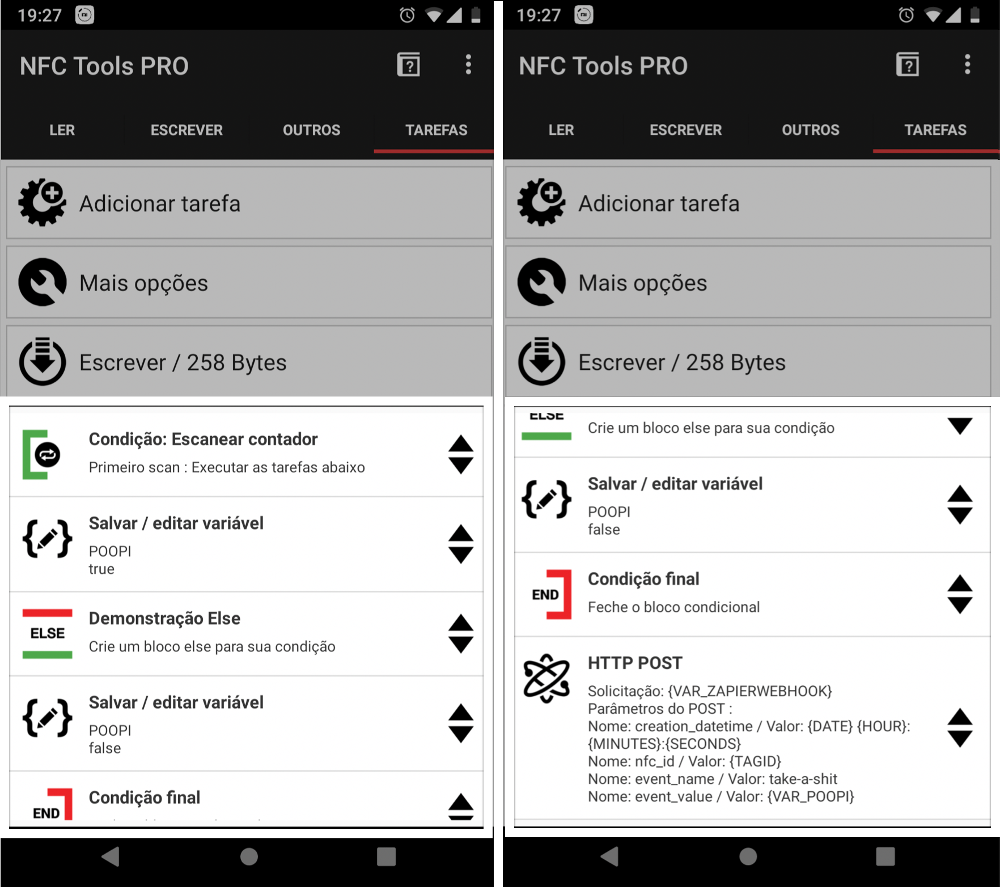

Yes I know it sounds dumb but, if during your working hours you go to the toilet, 
technically, _you are getting paid for it_. 💩

# Use case

Alright, lets say you you earn $10 an hour and during those 8 hours of daily work, you go twice to the bathroom, for around 10 minutes each time.

Then a simple multiplication shows that your _"poop time"_ is worth around **$3.34** per day!  

> 10 bucks an hour ≈ $1,67, for 10 minutes. 

Right? So if you do this everyday, during an year, (taking in consideration that you work around 22 days a month), 
then you get an astounding **$881.76** dollars a year, just for pooping!! 

Your poop is worth the same as an [iPhone 10](https://www.amazon.com/slp/iPhone-10/j8tt3mgq5e3o3ah)!! 

# NFC tags + Zapier to the rescue

Well I wanted to know how much 💸 I was making just by going to the bathroom during working hours and I needed something to keep track of my "going and coming".

I started by writing in a excel sheet but that was really not what I was looking for.  

Well, I had some [NFC tags](https://www.amazon.co.uk/Stickers-Genuine-Memory-Strong-Adhesive/dp/B07FNX864J/ref=sr_1_10?crid=PQ05CV5E123S&dchild=1&keywords=nfc+tags&qid=1591463153&sprefix=external+har%2Caps%2C467&sr=8-10) 
laying around and I've also had previously bought [NFC Tools](https://play.google.com/store/apps/details?id=com.wakdev.nfctools.pro&hl=pt_PT)
so I just decide to play around with those.

## Zapier Integration

Since I didnt want to fill a Google Spreadsheet every time I went to the bathroom, I end up creating a [Zapier](https://zapier.com/apps/) integration
with Google Spreadsheets, that would have an exposed web hook, which would be used by tapping the NFC tag.

It was a simple webhook that would store something like this:


creation_datetime	nfc_id	event_name	event_value
2017-03-25 17:11:49	04:2d:d1:62:a1:48:80	take-a-shit	TRUE
2017-03-25 17:14:53	04:2d:d1:62:a1:48:80	take-a-shit	FALSE
(...)


The important part is the ` event_value` which would work as a toggle, in which **True** means "Going to the bathroom" and **False** "Coming back".

## NFC Tag

I just wanted to have one tag, which I would tap with my phone and make the POST request to the Zapier wehbook.

So, I just end up creating a new task on "NFC Tools" app that would make an HTTP Post request to Zapier with the expected `event_value`.  

# Conclusions

Well long story short, I made **$134.39** during a period of **8 months**. 

## Summary 

| Month | Avg | Max | Min | 💰 Total 💰 |
| ----- | ----- | ----- | -----| ----- |
| Mar | 8.34 | 15.62 | 2.03 | $9.72 | 
| Apr | 9.36 | 13.83 | 2.67 | $23.41 | 
| May | 7.59 | 14.42 | 1.67 | $21.52 | 
| Jun | 8.3 | 13.83 | 3.13 | $20.76 | 
| Jul | 9.83 | 14.67 | 3.5 | $21.31 | 
| Aug | 9.62 | 13.27 | 3.67 | $17.63 | 
| Sep | 7.95 | 11.92 | 3.83 | $5.3 | 
| Oct | 12.64 | 17.7 | 8.28 | $14.75 | 
| **Total:** | **9.06** | **17.7** | **1.67** | **$134.39** |


fig = {"data":[{"marker":{"color":"rgb(0, 125, 209)"},"type":"bar","x":["2017-03-25","2017-03-27","2017-03-28","2017-03-30","2017-03-31","2017-04-03","2017-04-05","2017-04-06","2017-04-10","2017-04-12","2017-04-13","2017-04-17","2017-04-18","2017-04-19","2017-04-21","2017-04-26","2017-04-27","2017-05-02","2017-05-09","2017-05-10","2017-05-12","2017-05-16","2017-05-17","2017-05-22","2017-05-23","2017-05-26","2017-05-29","2017-05-30","2017-05-31","2017-06-05","2017-06-06","2017-06-07","2017-06-08","2017-06-09","2017-06-12","2017-06-14","2017-06-16","2017-06-19","2017-06-20","2017-06-21","2017-06-28","2017-06-30","2017-07-03","2017-07-04","2017-07-05","2017-07-07","2017-07-10","2017-07-12","2017-07-18","2017-07-24","2017-07-25","2017-07-26","2017-07-27","2017-08-14","2017-08-16","2017-08-17","2017-08-21","2017-08-22","2017-08-24","2017-08-25","2017-08-28","2017-09-18","2017-09-25","2017-09-27","2017-10-02","2017-10-03","2017-10-06","2017-10-10","2017-10-11","2017-10-16","2017-10-17"],"y":[2,2,1,1,1,1,1,1,1,1,1,2,1,2,1,2,1,1,1,1,1,1,1,3,2,1,1,2,2,1,2,1,1,1,1,1,2,1,1,1,1,1,1,1,2,1,1,1,1,1,1,1,2,2,2,1,1,1,2,1,1,1,2,1,1,1,1,1,1,1,1]}],"layout":{"margin":{"b":80,"l":80,"pad":2,"r":80,"t":100},"plot_bgcolor":"rgba(236, 236, 236, 0.3)","template":{"data":{"bar":[{"error_x":{"color":"#2a3f5f"},"error_y":{"color":"#2a3f5f"},"marker":{"line":{"color":"#E5ECF6","width":0.5}},"type":"bar"}],"barpolar":[{"marker":{"line":{"color":"#E5ECF6","width":0.5}},"type":"barpolar"}],"carpet":[{"aaxis":{"endlinecolor":"#2a3f5f","gridcolor":"white","linecolor":"white","minorgridcolor":"white","startlinecolor":"#2a3f5f"},"baxis":{"endlinecolor":"#2a3f5f","gridcolor":"white","linecolor":"white","minorgridcolor":"white","startlinecolor":"#2a3f5f"},"type":"carpet"}],"choropleth":[{"colorbar":{"outlinewidth":0,"ticks":""},"type":"choropleth"}],"contour":[{"colorbar":{"outlinewidth":0,"ticks":""},"colorscale":[[0.0,"#0d0887"],[0.1111111111111111,"#46039f"],[0.2222222222222222,"#7201a8"],[0.3333333333333333,"#9c179e"],[0.4444444444444444,"#bd3786"],[0.5555555555555556,"#d8576b"],[0.6666666666666666,"#ed7953"],[0.7777777777777778,"#fb9f3a"],[0.8888888888888888,"#fdca26"],[1.0,"#f0f921"]],"type":"contour"}],"contourcarpet":[{"colorbar":{"outlinewidth":0,"ticks":""},"type":"contourcarpet"}],"heatmap":[{"colorbar":{"outlinewidth":0,"ticks":""},"colorscale":[[0.0,"#0d0887"],[0.1111111111111111,"#46039f"],[0.2222222222222222,"#7201a8"],[0.3333333333333333,"#9c179e"],[0.4444444444444444,"#bd3786"],[0.5555555555555556,"#d8576b"],[0.6666666666666666,"#ed7953"],[0.7777777777777778,"#fb9f3a"],[0.8888888888888888,"#fdca26"],[1.0,"#f0f921"]],"type":"heatmap"}],"heatmapgl":[{"colorbar":{"outlinewidth":0,"ticks":""},"colorscale":[[0.0,"#0d0887"],[0.1111111111111111,"#46039f"],[0.2222222222222222,"#7201a8"],[0.3333333333333333,"#9c179e"],[0.4444444444444444,"#bd3786"],[0.5555555555555556,"#d8576b"],[0.6666666666666666,"#ed7953"],[0.7777777777777778,"#fb9f3a"],[0.8888888888888888,"#fdca26"],[1.0,"#f0f921"]],"type":"heatmapgl"}],"histogram":[{"marker":{"colorbar":{"outlinewidth":0,"ticks":""}},"type":"histogram"}],"histogram2d":[{"colorbar":{"outlinewidth":0,"ticks":""},"colorscale":[[0.0,"#0d0887"],[0.1111111111111111,"#46039f"],[0.2222222222222222,"#7201a8"],[0.3333333333333333,"#9c179e"],[0.4444444444444444,"#bd3786"],[0.5555555555555556,"#d8576b"],[0.6666666666666666,"#ed7953"],[0.7777777777777778,"#fb9f3a"],[0.8888888888888888,"#fdca26"],[1.0,"#f0f921"]],"type":"histogram2d"}],"histogram2dcontour":[{"colorbar":{"outlinewidth":0,"ticks":""},"colorscale":[[0.0,"#0d0887"],[0.1111111111111111,"#46039f"],[0.2222222222222222,"#7201a8"],[0.3333333333333333,"#9c179e"],[0.4444444444444444,"#bd3786"],[0.5555555555555556,"#d8576b"],[0.6666666666666666,"#ed7953"],[0.7777777777777778,"#fb9f3a"],[0.8888888888888888,"#fdca26"],[1.0,"#f0f921"]],"type":"histogram2dcontour"}],"mesh3d":[{"colorbar":{"outlinewidth":0,"ticks":""},"type":"mesh3d"}],"parcoords":[{"line":{"colorbar":{"outlinewidth":0,"ticks":""}},"type":"parcoords"}],"pie":[{"automargin":true,"type":"pie"}],"scatter":[{"marker":{"colorbar":{"outlinewidth":0,"ticks":""}},"type":"scatter"}],"scatter3d":[{"line":{"colorbar":{"outlinewidth":0,"ticks":""}},"marker":{"colorbar":{"outlinewidth":0,"ticks":""}},"type":"scatter3d"}],"scattercarpet":[{"marker":{"colorbar":{"outlinewidth":0,"ticks":""}},"type":"scattercarpet"}],"scattergeo":[{"marker":{"colorbar":{"outlinewidth":0,"ticks":""}},"type":"scattergeo"}],"scattergl":[{"marker":{"colorbar":{"outlinewidth":0,"ticks":""}},"type":"scattergl"}],"scattermapbox":[{"marker":{"colorbar":{"outlinewidth":0,"ticks":""}},"type":"scattermapbox"}],"scatterpolar":[{"marker":{"colorbar":{"outlinewidth":0,"ticks":""}},"type":"scatterpolar"}],"scatterpolargl":[{"marker":{"colorbar":{"outlinewidth":0,"ticks":""}},"type":"scatterpolargl"}],"scatterternary":[{"marker":{"colorbar":{"outlinewidth":0,"ticks":""}},"type":"scatterternary"}],"surface":[{"colorbar":{"outlinewidth":0,"ticks":""},"colorscale":[[0.0,"#0d0887"],[0.1111111111111111,"#46039f"],[0.2222222222222222,"#7201a8"],[0.3333333333333333,"#9c179e"],[0.4444444444444444,"#bd3786"],[0.5555555555555556,"#d8576b"],[0.6666666666666666,"#ed7953"],[0.7777777777777778,"#fb9f3a"],[0.8888888888888888,"#fdca26"],[1.0,"#f0f921"]],"type":"surface"}],"table":[{"cells":{"fill":{"color":"#EBF0F8"},"line":{"color":"white"}},"header":{"fill":{"color":"#C8D4E3"},"line":{"color":"white"}},"type":"table"}]},"layout":{"annotationdefaults":{"arrowcolor":"#2a3f5f","arrowhead":0,"arrowwidth":1},"coloraxis":{"colorbar":{"outlinewidth":0,"ticks":""}},"colorscale":{"diverging":[[0,"#8e0152"],[0.1,"#c51b7d"],[0.2,"#de77ae"],[0.3,"#f1b6da"],[0.4,"#fde0ef"],[0.5,"#f7f7f7"],[0.6,"#e6f5d0"],[0.7,"#b8e186"],[0.8,"#7fbc41"],[0.9,"#4d9221"],[1,"#276419"]],"sequential":[[0.0,"#0d0887"],[0.1111111111111111,"#46039f"],[0.2222222222222222,"#7201a8"],[0.3333333333333333,"#9c179e"],[0.4444444444444444,"#bd3786"],[0.5555555555555556,"#d8576b"],[0.6666666666666666,"#ed7953"],[0.7777777777777778,"#fb9f3a"],[0.8888888888888888,"#fdca26"],[1.0,"#f0f921"]],"sequentialminus":[[0.0,"#0d0887"],[0.1111111111111111,"#46039f"],[0.2222222222222222,"#7201a8"],[0.3333333333333333,"#9c179e"],[0.4444444444444444,"#bd3786"],[0.5555555555555556,"#d8576b"],[0.6666666666666666,"#ed7953"],[0.7777777777777778,"#fb9f3a"],[0.8888888888888888,"#fdca26"],[1.0,"#f0f921"]]},"colorway":["#636efa","#EF553B","#00cc96","#ab63fa","#FFA15A","#19d3f3","#FF6692","#B6E880","#FF97FF","#FECB52"],"font":{"color":"#2a3f5f"},"geo":{"bgcolor":"white","lakecolor":"white","landcolor":"#E5ECF6","showlakes":true,"showland":true,"subunitcolor":"white"},"hoverlabel":{"align":"left"},"hovermode":"closest","mapbox":{"style":"light"},"paper_bgcolor":"white","plot_bgcolor":"#E5ECF6","polar":{"angularaxis":{"gridcolor":"white","linecolor":"white","ticks":""},"bgcolor":"#E5ECF6","radialaxis":{"gridcolor":"white","linecolor":"white","ticks":""}},"scene":{"xaxis":{"backgroundcolor":"#E5ECF6","gridcolor":"white","gridwidth":2,"linecolor":"white","showbackground":true,"ticks":"","zerolinecolor":"white"},"yaxis":{"backgroundcolor":"#E5ECF6","gridcolor":"white","gridwidth":2,"linecolor":"white","showbackground":true,"ticks":"","zerolinecolor":"white"},"zaxis":{"backgroundcolor":"#E5ECF6","gridcolor":"white","gridwidth":2,"linecolor":"white","showbackground":true,"ticks":"","zerolinecolor":"white"}},"shapedefaults":{"line":{"color":"#2a3f5f"}},"ternary":{"aaxis":{"gridcolor":"white","linecolor":"white","ticks":""},"baxis":{"gridcolor":"white","linecolor":"white","ticks":""},"bgcolor":"#E5ECF6","caxis":{"gridcolor":"white","linecolor":"white","ticks":""}},"title":{"x":0.05},"xaxis":{"automargin":true,"gridcolor":"white","linecolor":"white","ticks":"","title":{"standoff":15},"zerolinecolor":"white","zerolinewidth":2},"yaxis":{"automargin":true,"gridcolor":"white","linecolor":"white","ticks":"","title":{"standoff":15},"zerolinecolor":"white","zerolinewidth":2}}},"title":{"font":{"size":30},"text":"Going to \ud83d\udebd"},"width":825,"xaxis":{"linecolor":"#000","linewidth":1,"title":{"text":""}},"yaxis":{"title":{"text":"Count"}}}}



fig = {"data":[{"marker":{"color":"rgb(0, 125, 209)"},"type":"bar","x":["2017-03-25","2017-03-27","2017-03-28","2017-03-30","2017-03-31","2017-04-03","2017-04-05","2017-04-06","2017-04-10","2017-04-12","2017-04-13","2017-04-17","2017-04-18","2017-04-19","2017-04-21","2017-04-26","2017-04-27","2017-05-02","2017-05-09","2017-05-10","2017-05-12","2017-05-16","2017-05-17","2017-05-22","2017-05-23","2017-05-26","2017-05-29","2017-05-30","2017-05-31","2017-06-05","2017-06-06","2017-06-07","2017-06-08","2017-06-09","2017-06-12","2017-06-14","2017-06-16","2017-06-19","2017-06-20","2017-06-21","2017-06-28","2017-06-30","2017-07-03","2017-07-04","2017-07-05","2017-07-07","2017-07-10","2017-07-12","2017-07-18","2017-07-24","2017-07-25","2017-07-26","2017-07-27","2017-08-14","2017-08-16","2017-08-17","2017-08-21","2017-08-22","2017-08-24","2017-08-25","2017-08-28","2017-09-18","2017-09-25","2017-09-27","2017-10-02","2017-10-03","2017-10-06","2017-10-10","2017-10-11","2017-10-16","2017-10-17"],"y":[6,16,16,12,11,14,14,9,10,10,14,22,7,15,13,7,11,3,15,10,2,4,6,12,18,10,12,18,25,8,18,7,4,7,12,12,11,9,12,8,10,13,7,12,12,9,14,4,8,12,15,10,29,22,21,13,12,8,16,14,4,10,11,12,10,9,18,9,16,18,12]}],"layout":{"margin":{"b":80,"l":80,"pad":2,"r":80,"t":100},"plot_bgcolor":"rgba(236, 236, 236, 0.3)","template":{"data":{"bar":[{"error_x":{"color":"#2a3f5f"},"error_y":{"color":"#2a3f5f"},"marker":{"line":{"color":"#E5ECF6","width":0.5}},"type":"bar"}],"barpolar":[{"marker":{"line":{"color":"#E5ECF6","width":0.5}},"type":"barpolar"}],"carpet":[{"aaxis":{"endlinecolor":"#2a3f5f","gridcolor":"white","linecolor":"white","minorgridcolor":"white","startlinecolor":"#2a3f5f"},"baxis":{"endlinecolor":"#2a3f5f","gridcolor":"white","linecolor":"white","minorgridcolor":"white","startlinecolor":"#2a3f5f"},"type":"carpet"}],"choropleth":[{"colorbar":{"outlinewidth":0,"ticks":""},"type":"choropleth"}],"contour":[{"colorbar":{"outlinewidth":0,"ticks":""},"colorscale":[[0.0,"#0d0887"],[0.1111111111111111,"#46039f"],[0.2222222222222222,"#7201a8"],[0.3333333333333333,"#9c179e"],[0.4444444444444444,"#bd3786"],[0.5555555555555556,"#d8576b"],[0.6666666666666666,"#ed7953"],[0.7777777777777778,"#fb9f3a"],[0.8888888888888888,"#fdca26"],[1.0,"#f0f921"]],"type":"contour"}],"contourcarpet":[{"colorbar":{"outlinewidth":0,"ticks":""},"type":"contourcarpet"}],"heatmap":[{"colorbar":{"outlinewidth":0,"ticks":""},"colorscale":[[0.0,"#0d0887"],[0.1111111111111111,"#46039f"],[0.2222222222222222,"#7201a8"],[0.3333333333333333,"#9c179e"],[0.4444444444444444,"#bd3786"],[0.5555555555555556,"#d8576b"],[0.6666666666666666,"#ed7953"],[0.7777777777777778,"#fb9f3a"],[0.8888888888888888,"#fdca26"],[1.0,"#f0f921"]],"type":"heatmap"}],"heatmapgl":[{"colorbar":{"outlinewidth":0,"ticks":""},"colorscale":[[0.0,"#0d0887"],[0.1111111111111111,"#46039f"],[0.2222222222222222,"#7201a8"],[0.3333333333333333,"#9c179e"],[0.4444444444444444,"#bd3786"],[0.5555555555555556,"#d8576b"],[0.6666666666666666,"#ed7953"],[0.7777777777777778,"#fb9f3a"],[0.8888888888888888,"#fdca26"],[1.0,"#f0f921"]],"type":"heatmapgl"}],"histogram":[{"marker":{"colorbar":{"outlinewidth":0,"ticks":""}},"type":"histogram"}],"histogram2d":[{"colorbar":{"outlinewidth":0,"ticks":""},"colorscale":[[0.0,"#0d0887"],[0.1111111111111111,"#46039f"],[0.2222222222222222,"#7201a8"],[0.3333333333333333,"#9c179e"],[0.4444444444444444,"#bd3786"],[0.5555555555555556,"#d8576b"],[0.6666666666666666,"#ed7953"],[0.7777777777777778,"#fb9f3a"],[0.8888888888888888,"#fdca26"],[1.0,"#f0f921"]],"type":"histogram2d"}],"histogram2dcontour":[{"colorbar":{"outlinewidth":0,"ticks":""},"colorscale":[[0.0,"#0d0887"],[0.1111111111111111,"#46039f"],[0.2222222222222222,"#7201a8"],[0.3333333333333333,"#9c179e"],[0.4444444444444444,"#bd3786"],[0.5555555555555556,"#d8576b"],[0.6666666666666666,"#ed7953"],[0.7777777777777778,"#fb9f3a"],[0.8888888888888888,"#fdca26"],[1.0,"#f0f921"]],"type":"histogram2dcontour"}],"mesh3d":[{"colorbar":{"outlinewidth":0,"ticks":""},"type":"mesh3d"}],"parcoords":[{"line":{"colorbar":{"outlinewidth":0,"ticks":""}},"type":"parcoords"}],"pie":[{"automargin":true,"type":"pie"}],"scatter":[{"marker":{"colorbar":{"outlinewidth":0,"ticks":""}},"type":"scatter"}],"scatter3d":[{"line":{"colorbar":{"outlinewidth":0,"ticks":""}},"marker":{"colorbar":{"outlinewidth":0,"ticks":""}},"type":"scatter3d"}],"scattercarpet":[{"marker":{"colorbar":{"outlinewidth":0,"ticks":""}},"type":"scattercarpet"}],"scattergeo":[{"marker":{"colorbar":{"outlinewidth":0,"ticks":""}},"type":"scattergeo"}],"scattergl":[{"marker":{"colorbar":{"outlinewidth":0,"ticks":""}},"type":"scattergl"}],"scattermapbox":[{"marker":{"colorbar":{"outlinewidth":0,"ticks":""}},"type":"scattermapbox"}],"scatterpolar":[{"marker":{"colorbar":{"outlinewidth":0,"ticks":""}},"type":"scatterpolar"}],"scatterpolargl":[{"marker":{"colorbar":{"outlinewidth":0,"ticks":""}},"type":"scatterpolargl"}],"scatterternary":[{"marker":{"colorbar":{"outlinewidth":0,"ticks":""}},"type":"scatterternary"}],"surface":[{"colorbar":{"outlinewidth":0,"ticks":""},"colorscale":[[0.0,"#0d0887"],[0.1111111111111111,"#46039f"],[0.2222222222222222,"#7201a8"],[0.3333333333333333,"#9c179e"],[0.4444444444444444,"#bd3786"],[0.5555555555555556,"#d8576b"],[0.6666666666666666,"#ed7953"],[0.7777777777777778,"#fb9f3a"],[0.8888888888888888,"#fdca26"],[1.0,"#f0f921"]],"type":"surface"}],"table":[{"cells":{"fill":{"color":"#EBF0F8"},"line":{"color":"white"}},"header":{"fill":{"color":"#C8D4E3"},"line":{"color":"white"}},"type":"table"}]},"layout":{"annotationdefaults":{"arrowcolor":"#2a3f5f","arrowhead":0,"arrowwidth":1},"coloraxis":{"colorbar":{"outlinewidth":0,"ticks":""}},"colorscale":{"diverging":[[0,"#8e0152"],[0.1,"#c51b7d"],[0.2,"#de77ae"],[0.3,"#f1b6da"],[0.4,"#fde0ef"],[0.5,"#f7f7f7"],[0.6,"#e6f5d0"],[0.7,"#b8e186"],[0.8,"#7fbc41"],[0.9,"#4d9221"],[1,"#276419"]],"sequential":[[0.0,"#0d0887"],[0.1111111111111111,"#46039f"],[0.2222222222222222,"#7201a8"],[0.3333333333333333,"#9c179e"],[0.4444444444444444,"#bd3786"],[0.5555555555555556,"#d8576b"],[0.6666666666666666,"#ed7953"],[0.7777777777777778,"#fb9f3a"],[0.8888888888888888,"#fdca26"],[1.0,"#f0f921"]],"sequentialminus":[[0.0,"#0d0887"],[0.1111111111111111,"#46039f"],[0.2222222222222222,"#7201a8"],[0.3333333333333333,"#9c179e"],[0.4444444444444444,"#bd3786"],[0.5555555555555556,"#d8576b"],[0.6666666666666666,"#ed7953"],[0.7777777777777778,"#fb9f3a"],[0.8888888888888888,"#fdca26"],[1.0,"#f0f921"]]},"colorway":["#636efa","#EF553B","#00cc96","#ab63fa","#FFA15A","#19d3f3","#FF6692","#B6E880","#FF97FF","#FECB52"],"font":{"color":"#2a3f5f"},"geo":{"bgcolor":"white","lakecolor":"white","landcolor":"#E5ECF6","showlakes":true,"showland":true,"subunitcolor":"white"},"hoverlabel":{"align":"left"},"hovermode":"closest","mapbox":{"style":"light"},"paper_bgcolor":"white","plot_bgcolor":"#E5ECF6","polar":{"angularaxis":{"gridcolor":"white","linecolor":"white","ticks":""},"bgcolor":"#E5ECF6","radialaxis":{"gridcolor":"white","linecolor":"white","ticks":""}},"scene":{"xaxis":{"backgroundcolor":"#E5ECF6","gridcolor":"white","gridwidth":2,"linecolor":"white","showbackground":true,"ticks":"","zerolinecolor":"white"},"yaxis":{"backgroundcolor":"#E5ECF6","gridcolor":"white","gridwidth":2,"linecolor":"white","showbackground":true,"ticks":"","zerolinecolor":"white"},"zaxis":{"backgroundcolor":"#E5ECF6","gridcolor":"white","gridwidth":2,"linecolor":"white","showbackground":true,"ticks":"","zerolinecolor":"white"}},"shapedefaults":{"line":{"color":"#2a3f5f"}},"ternary":{"aaxis":{"gridcolor":"white","linecolor":"white","ticks":""},"baxis":{"gridcolor":"white","linecolor":"white","ticks":""},"bgcolor":"#E5ECF6","caxis":{"gridcolor":"white","linecolor":"white","ticks":""}},"title":{"x":0.05},"xaxis":{"automargin":true,"gridcolor":"white","linecolor":"white","ticks":"","title":{"standoff":15},"zerolinecolor":"white","zerolinewidth":2},"yaxis":{"automargin":true,"gridcolor":"white","linecolor":"white","ticks":"","title":{"standoff":15},"zerolinecolor":"white","zerolinewidth":2}}},"title":{"font":{"size":30},"text":"Time spent \ud83d\udebd"},"width":825,"xaxis":{"linecolor":"#000","linewidth":1,"title":{"text":" "}},"yaxis":{"ticksuffix":"min","title":{"text":"Count"}}}}


Also, realized that I spend an average of **10 minutes** in the bathroom, which according to [infographicsarchive.com](https://www.infographicsarchive.com/how-long-do-you-spend-in-the-bathroom/), its alright.


fig = {"data":[{"legendgroup":"Time in seconds","marker":{"color":"rgb(31, 119, 180)"},"mode":"lines","name":"Time in seconds","showlegend":true,"type":"scatter","x":[100.0,101.924,103.848,105.772,107.696,109.62,111.544,113.468,115.392,117.316,119.24,121.164,123.088,125.012,126.936,128.86,130.784,132.708,134.632,136.55599999999998,138.48,140.404,142.328,144.252,146.176,148.1,150.024,151.948,153.872,155.796,157.72,159.644,161.56799999999998,163.492,165.416,167.34,169.264,171.188,173.112,175.036,176.95999999999998,178.88400000000001,180.808,182.732,184.656,186.57999999999998,188.50400000000002,190.428,192.352,194.276,196.2,198.124,200.048,201.97199999999998,203.89600000000002,205.82,207.744,209.668,211.59199999999998,213.51600000000002,215.44,217.364,219.288,221.212,223.136,225.06,226.98399999999998,228.908,230.832,232.756,234.68,236.604,238.528,240.452,242.376,244.3,246.224,248.148,250.072,251.996,253.92,255.844,257.76800000000003,259.692,261.616,263.53999999999996,265.464,267.38800000000003,269.312,271.236,273.15999999999997,275.084,277.00800000000004,278.932,280.856,282.78,284.704,286.628,288.552,290.476,292.4,294.324,296.248,298.172,300.096,302.02,303.94399999999996,305.868,307.79200000000003,309.716,311.64,313.56399999999996,315.488,317.41200000000003,319.336,321.26,323.18399999999997,325.108,327.03200000000004,328.956,330.88,332.804,334.728,336.652,338.576,340.5,342.424,344.348,346.272,348.196,350.12,352.044,353.96799999999996,355.892,357.816,359.74,361.664,363.588,365.512,367.436,369.36,371.284,373.208,375.132,377.056,378.98,380.904,382.828,384.752,386.676,388.6,390.524,392.448,394.372,396.296,398.22,400.144,402.068,403.992,405.916,407.84,409.764,411.688,413.612,415.536,417.46,419.384,421.308,423.232,425.156,427.08,429.004,430.928,432.852,434.776,436.7,438.624,440.548,442.472,444.396,446.32,448.244,450.168,452.092,454.016,455.94,457.864,459.788,461.712,463.636,465.56,467.484,469.408,471.332,473.256,475.18,477.104,479.028,480.952,482.876,484.8,486.724,488.648,490.572,492.496,494.42,496.344,498.268,500.192,502.116,504.04,505.964,507.888,509.812,511.736,513.6600000000001,515.5840000000001,517.508,519.432,521.356,523.28,525.204,527.1279999999999,529.052,530.976,532.9,534.8240000000001,536.748,538.672,540.596,542.52,544.444,546.3679999999999,548.2919999999999,550.216,552.14,554.0640000000001,555.988,557.912,559.836,561.76,563.684,565.608,567.5319999999999,569.456,571.38,573.304,575.2280000000001,577.152,579.076,581.0,582.924,584.848,586.7719999999999,588.696,590.62,592.544,594.4680000000001,596.392,598.316,600.24,602.164,604.088,606.012,607.9359999999999,609.86,611.784,613.708,615.632,617.556,619.48,621.404,623.328,625.252,627.176,629.1,631.024,632.948,634.872,636.796,638.72,640.644,642.568,644.492,646.416,648.34,650.264,652.188,654.112,656.036,657.96,659.884,661.808,663.732,665.656,667.58,669.504,671.428,673.352,675.276,677.2,679.124,681.048,682.972,684.896,686.82,688.744,690.668,692.592,694.516,696.44,698.364,700.288,702.212,704.136,706.06,707.984,709.908,711.832,713.756,715.68,717.604,719.528,721.452,723.376,725.3,727.224,729.148,731.072,732.996,734.92,736.844,738.768,740.692,742.616,744.54,746.464,748.388,750.312,752.236,754.16,756.084,758.008,759.932,761.856,763.78,765.704,767.628,769.552,771.476,773.4,775.324,777.248,779.172,781.096,783.02,784.944,786.868,788.792,790.716,792.64,794.564,796.488,798.412,800.336,802.26,804.184,806.108,808.032,809.956,811.88,813.804,815.728,817.652,819.576,821.5,823.424,825.348,827.272,829.196,831.12,833.044,834.968,836.892,838.816,840.74,842.664,844.588,846.512,848.436,850.36,852.284,854.208,856.132,858.056,859.98,861.904,863.828,865.752,867.676,869.6,871.524,873.448,875.372,877.296,879.22,881.144,883.068,884.992,886.916,888.84,890.764,892.688,894.612,896.536,898.46,900.384,902.308,904.232,906.156,908.08,910.004,911.928,913.852,915.776,917.7,919.624,921.548,923.472,925.396,927.32,929.244,931.168,933.092,935.016,936.94,938.864,940.788,942.712,944.636,946.56,948.484,950.408,952.332,954.256,956.18,958.104,960.028,961.952,963.876,965.8,967.724,969.648,971.572,973.496,975.42,977.344,979.268,981.192,983.116,985.04,986.964,988.888,990.812,992.736,994.66,996.584,998.508,1000.432,1002.356,1004.28,1006.204,1008.128,1010.052,1011.976,1013.9,1015.824,1017.748,1019.672,1021.596,1023.52,1025.444,1027.368,1029.292,1031.216,1033.1399999999999,1035.0639999999999,1036.988,1038.912,1040.836,1042.76,1044.684,1046.608,1048.5320000000002,1050.4560000000001,1052.38,1054.304,1056.228,1058.152,1060.076],"xaxis":"x","y":[0.00048683377686578865,0.0004950853768645812,0.0005033302156002165,0.0005115639184963012,0.0005197820916906905,0.0005279803282874459,0.0005361542147325914,0.000544299337302645,0.0005524112886944378,0.0005604856747042498,0.0005685181209838588,0.0005765042798606745,0.0005844398372087375,0.0005923205193569854,0.0006001421000208572,0.0006079004072429876,0.000615591330328461,0.0006232108267598592,0.0006307549290770993,0.0006382197517069117,0.0006456014977266372,0.0006528964655469339,0.0006601010554979186,0.0006672117763032462,0.0006742252514266378,0.0006811382252754392,0.000687947569245884,0.0006946502875948928,0.0007012435231234121,0.0007077245626565515,0.0007140908423060293,0.0007203399525007862,0.0007264696427719751,0.0007324778262789424,0.0007383625840632893,0.0007441221690185805,0.0007497550095638168,0.0007552597130093566,0.00076063506860462,0.0007658800502575362,0.0007709938189164112,0.0007759757246056456,0.0007808253081074559,0.0007855423022826148,0.0007901266330240075,0.0007945784198377057,0.0007988979760471314,0.0008030858086168026,0.0008071426175930952,0.0008110692951604072,0.0008148669243120937,0.0008185367771365309,0.0008220803127196451,0.0008254991746662966,0.000828795188243872,0.0008319703571524889,0.0008350268599272129,0.0008379670459787179,0.0008407934312797872,0.0008435086937060904,0.0008461156680405999,0.0008486173406520185,0.000851016843858488,0.0008533174499887759,0.000855522565154047,0.0008576357227441338,0.0008596605766630972,0.0008616008943196018,0.0008634605493884228,0.0008652435143600578,0.0008669538528961133,0.0008685957120087221,0.0008701733140828042,0.0008716909487605023,0.0008731529647075626,0.0008745637612818228,0.0008759277801243103,0.0008772494966937174,0.0008785334117652391,0.0008797840429148937,0.0008810059160105516,0.0008822035567308819,0.0008833814821334134,0.0008845441922927668,0.0008856961620299479,0.0008868418327533365,0.0008879856044317043,0.000889131827719212,0.0008902847962518842,0.000891448739134586,0.0008926278136369216,0.0008938260981158861,0.0008950475851823875,0.0008962961751280398,0.0008975756696278126,0.0008988897657333008,0.000900242050170459,0.0009016359939547264,0.0009030749473354764,0.000904562135080692,0.0009061006521117376,0.0009076934594969839,0.000909343380811918,0.0009110530988722643,0.0009128251528454237,0.0009146619357444013,0.0009165656923071709,0.0009185385172632321,0.0009205823539879047,0.0009226989935436968,0.0009248900741068821,0.0009271570807762199,0.0009295013457595754,0.0009319240489330292,0.0009344262187659245,0.000937008733604173,0.0009396723233030547,0.0009424175711997072,0.000945244916414444,0.0009481546564691074,0.0009511469502096905,0.0009542218210195981,0.0009573791603090835,0.0009606187312655958,0.0009639401728490757,0.0009673430040155508,0.0009708266281517986,0.0009743903377032795,0.0009780333189771053,0.0009817546571013673,0.000985553341121836,0.0009894282692167638,0.0009933782540103347,0.0009974020279651713,0.0010014982488342678,0.0010056655051527172,0.0010099023217497133,0.0010142071652614547,0.0010185784496257995,0.0010230145415398443,0.0010275137658619393,0.0010320744109401042,0.0010366947338492898,0.001041372965520498,0.0010461073157453863,0.001050895978040657,0.001055737134357251,0.0010606289596201588,0.0010655696260854705,0.0010705573075021713,0.0010755901830670819,0.001080666441162309,0.0010857842828655285,0.0010909419252244604,0.0010961376042878835,0.0011013695778866565,0.0011066361281592016,0.0011119355638170574,0.0011172662221471635,0.0011226264707486183,0.0011280147090027839,0.0011334293692766505,0.001138868917860479,0.0011443318556417885,0.001149816718518796,0.0011553220775574408,0.0011608465388971098,0.0011663887434111612,0.0011719473661292493,0.0011775211154293505,0.001183108732008273,0.0011887089876401625,0.0011943206837333785,0.0011999426496967281,0.00120557374112676,0.0012112128378284099,0.0012168588416818196,0.0012225106743686558,0.0012281672749716787,0.0012338275974616638,0.0012394906080861077,0.0012451552826743502,0.0012508206038739863,0.00125648555833347,0.0012621491338459475,0.0012678103164692762,0.0012734680876371604,0.0012791214212761685,0.0012847692809432097,0.0012904106169977956,0.0012960443638230941,0.0013016694371094232,0.0013072847312134092,0.0013128891166055518,0.0013184814374184461,0.0013240605091073266,0.0013296251162340006,0.0013351740103845916,0.0013407059082308447,0.0013462194897440217,0.0013517133965696736,0.0013571862305708257,0.0013626365525463103,0.0013680628811301857,0.001373463691877358,0.0013788374165396996,0.0013841824425361205,0.001389497112619209,0.0013947797247402388,0.0014000285321134882,0.0014052417434800178,0.0014104175235702262,0.0014155539937637275,0.0014206492329443094,0.0014257012785469836,0.001430708127793415,0.0014356677391113174,0.0014405780337327385,0.001445436897465521,0.0014502421826316245,0.0014549917101654463,0.0014596832718647445,0.0014643146327862823,0.001468883533777899,0.0014733876941382853,0.0014778248143954233,0.0014821925791943119,0.0014864886602843769,0.001490710719596705,0.0014948564124011186,0.001498923390532948,0.0015029093056792894,0.0015068118127145092,0.001510628573074743,0.0015143572581612051,0.0015179955527621887,0.001521541158483787,0.0015249917971795045,0.0015283452143691337,0.0015315991826375247,0.0015347515050040603,0.001537800018254054,0.0015407425962234746,0.0015435771530288326,0.0015463016462343745,0.0015489140799491029,0.001551412507846559,0.0015537950361006756,0.0015560598262314295,0.0015582050978544685,0.0015602291313292554,0.001562130270300759,0.0015639069241301091,0.0015655575702100697,0.0015670807561616116,0.0015684751019082554,0.001569739301625301,0.0015708721255613906,0.0015718724217303175,0.0015727391174712821,0.0015734712208761866,0.0015740678220829178,0.0015745280944338294,0.0015748512954990004,0.001575036767964079,0.0015750839403828214,0.001574992327794659,0.0015747615322078618,0.0015743912429490772,0.0015738812368801959,0.0015732313784836865,0.0015724416198176746,0.0015715120003422036,0.001570442646618178,0.0015692337718806835,0.0015678856754883714,0.0015663987422507419,0.0015647734416352071,0.0015630103268558522,0.0015611100338459001,0.0015590732801158947,0.0015569008634996639,0.0015545936607901847,0.0015521526262674572,0.0015495787901205675,0.001546873256766137,0.0015440372030653892,0.0015410718764421202,0.0015379785929038852,0.0015347587349687972,0.0015314137495003593,0.001527945145452863,0.0015243544915299297,0.0015206434137588953,0.0015168135929838286,0.001512866762280087,0.001508804704293447,0.0015046292485070005,0.001500342268439132,0.0014959456787760979,0.001491441432442866,0.001486831517616101,0.0014821179546833495,0.001477302793152722,0.0014723881085175518,0.0014673759990807705,0.0014622685827439597,0.001457067993766258,0.0014517763794985835,0.0014463958970988323,0.0014409287102339912,0.0014353769857753053,0.0014297428904929087,0.0014240285877565354,0.0014182362342491513,0.0014123679767005575,0.0014064259486482006,0.0014004122672326245,0.0013943290300351405,0.001388178311965442,0.0013819621622070146,0.0013756826012282768,0.001369341617867477,0.00136294116649939,0.001356483164291896,0.001349969488560491,0.0013434019742287221,0.001336782411402508,0.0013301125430660878,0.0013233940629073188,0.0013166286132797456,0.0013098177833086827,0.0013029631071483168,0.0012960660623964702,0.0012891280686734004,0.001282150486370592,0.00127513461557511,0.0012680816951746415,0.0012609929021478665,0.0012538693510443023,0.0012467120936572212,0.0012395221188926805,0.0012323003528370807,0.0012250476590251074,0.0012177648389091894,0.001210452632531023,0.0012031117193949668,0.0011957427195424643,0.0011883461948259111,0.0011809226503796905,0.0011734725362853732,0.0011659962494273428,0.0011584941355344228,0.0011509664914023008,0.0011434135672909122,0.001135835569490188,0.0011282326630469158,0.0011206049746447914,0.001112952595629099,0.0011052755851668216,0.0010975739735324278,0.0010898477655089667,0.0010820969438936356,0.0010743214730964388,0.0010665213028201487,0.001058696371809334,0.0010508466116558879,0.0010429719506481344,0.0010350723176503437,0.0010271476459992575,0.0010191978774040384,0.0010112229658359602,0.001003222881394072,0.0009951976141330551,0.0009871471778395483,0.0009790716137432834,0.0009709709941495461,0.0009628454259796746,0.0009546950542065436,0.0009465200651723229,0.0009383206897761252,0.0009300972065195935,0.0009218499443989229,0.0009135792856323054,0.0009052856682123694,0.0008969695882737309,0.0008886316022664472,0.0008802723289268,0.0008718924510375648,0.0008634927169706275,0.0008550739420056151,0.0008466370094189426,0.0008381828713385584,0.000829712549360421,0.0008212271349236636,0.0008127277894422113,0.0008042157441914876,0.0007956922999497566,0.00078715882639446,0.0007786167612548392,0.0007700676092229542,0.0007615129406260843,0.0007529543898643538,0.0007443936536182138,0.0007358324888312651,0.0007272727104746662,0.000718716189100122,0.000710164848189223,0.0007016206613075512,0.0006930856490726845,0.0006845618759458278,0.0006760514468574111,0.0006675565036775432,0.000659079221542708,0.0006506218050505755,0.0006421864843352054,0.0006337755110352895,0.000625391154168413,0.0006170356959245967,0.0006087114273925795,0.0006004206442325113,0.0005921656423088149,0.000583948713297085,0.0005757721402788772,0.0005676381933382516,0.000559549125173824,0.0005515071667399811,0.0005435145229307133,0.0005355733683193282,0.00052768584296702,0.000519854048312963,0.0005120800431582593,0.0005043658397556458,0.000496713400016478,0.000489124631845986,0.0004816013856173412,0.0004741454507945038,0.0004667585527132636,0.0004594423495292964,0.00045219842934143486,0.00044502830749770306,0.0004379334240910159,0.0004309151416507421,0.00042397474303566607,0.0004171134295331424,0.00041033231916854946,0.0004036324452284071,0.00039701475499981164,0.0003904801087280979,0.0003840292787939336,0.0003776629491103086,0.0003713817147391876,0.00036518608172686663,0.00035907646715640926,0.00035305319941482714,0.00034711651867203947,0.00034126657756797317,0.0003355034421035633,0.00032982709273079536,0.00032423742563637386,0.0003187342542130291,0.0003133173107119768,0.00030798624806952104,0.00030274064190036713,0.0002975799926497391,0.0002925037278960353,0.0002875112047953667,0.00028260171265900467,0.00027777447565447333,0.00027302865562074907,0.0002683633549878315,0.0002637776197907449,0.00025927044276788483,0.0002548407665335249,0.00025048748681420383,0.0002462094557386909,0.0002420054851712103,0.00023787435007764486,0.00023381479191450359,0.00022982552203052738,0.00022590522507095651,0.0002220525623746308,0.00021826617535429288,0.0002145446888506924,0.00021088671445133457,0.00020729085376499623,0.00020375570164343703,0.0002002798493420605,0.00019686188761162393,0.00019350040971347234,0.00019019401435115587,0.00018694130851169705,0.00018374091021018833,0.0001805914511318477,0.00017749157916609152,0.0001744399608276473,0.0001714352835601888,0.0001684762579184506,0.00016556161962524534,0.0001626901315002898],"yaxis":"y"},{"legendgroup":"Time in seconds","marker":{"color":"rgb(31, 119, 180)","symbol":"line-ns-open"},"mode":"markers","name":"Time in seconds","showlegend":false,"type":"scatter","x":[184.0,122.0,321.0,607.0,937.0,710.0,620.0,805.0,830.0,539.0,596.0,593.0,807.0,687.0,591.0,391.0,552.0,291.0,726.0,160.0,248.0,611.0,134.0,865.0,542.0,100.0,203.0,330.0,167.0,163.0,353.0,479.0,599.0,576.0,673.0,676.0,390.0,856.0,640.0,422.0,243.0,830.0,392.0,188.0,410.0,671.0,689.0,220.0,390.0,505.0,694.0,470.0,578.0,770.0,389.0,699.0,480.0,239.0,533.0,820.0,210.0,420.0,712.0,840.0,590.0,880.0,859.0,582.0,688.0,567.0,680.0,771.0,680.0,454.0,450.0,460.0,796.0,220.0,572.0,390.0,230.0,715.0,574.0,497.0,1038.0,520.0,901.0,1062.0,718.0],"xaxis":"x","y":["Time in seconds","Time in seconds","Time in seconds","Time in seconds","Time in seconds","Time in seconds","Time in seconds","Time in seconds","Time in seconds","Time in seconds","Time in seconds","Time in seconds","Time in seconds","Time in seconds","Time in seconds","Time in seconds","Time in seconds","Time in seconds","Time in seconds","Time in seconds","Time in seconds","Time in seconds","Time in seconds","Time in seconds","Time in seconds","Time in seconds","Time in seconds","Time in seconds","Time in seconds","Time in seconds","Time in seconds","Time in seconds","Time in seconds","Time in seconds","Time in seconds","Time in seconds","Time in seconds","Time in seconds","Time in seconds","Time in seconds","Time in seconds","Time in seconds","Time in seconds","Time in seconds","Time in seconds","Time in seconds","Time in seconds","Time in seconds","Time in seconds","Time in seconds","Time in seconds","Time in seconds","Time in seconds","Time in seconds","Time in seconds","Time in seconds","Time in seconds","Time in seconds","Time in seconds","Time in seconds","Time in seconds","Time in seconds","Time in seconds","Time in seconds","Time in seconds","Time in seconds","Time in seconds","Time in seconds","Time in seconds","Time in seconds","Time in seconds","Time in seconds","Time in seconds","Time in seconds","Time in seconds","Time in seconds","Time in seconds","Time in seconds","Time in seconds","Time in seconds","Time in seconds","Time in seconds","Time in seconds","Time in seconds","Time in seconds","Time in seconds","Time in seconds","Time in seconds","Time in seconds"],"yaxis":"y2"}],"layout":{"barmode":"overlay","hovermode":"closest","legend":{"traceorder":"reversed"},"margin":{"b":80,"l":80,"pad":2,"r":80,"t":100},"plot_bgcolor":"rgba(236, 236, 236, 0.3)","showlegend":false,"template":{"data":{"bar":[{"error_x":{"color":"#2a3f5f"},"error_y":{"color":"#2a3f5f"},"marker":{"line":{"color":"#E5ECF6","width":0.5}},"type":"bar"}],"barpolar":[{"marker":{"line":{"color":"#E5ECF6","width":0.5}},"type":"barpolar"}],"carpet":[{"aaxis":{"endlinecolor":"#2a3f5f","gridcolor":"white","linecolor":"white","minorgridcolor":"white","startlinecolor":"#2a3f5f"},"baxis":{"endlinecolor":"#2a3f5f","gridcolor":"white","linecolor":"white","minorgridcolor":"white","startlinecolor":"#2a3f5f"},"type":"carpet"}],"choropleth":[{"colorbar":{"outlinewidth":0,"ticks":""},"type":"choropleth"}],"contour":[{"colorbar":{"outlinewidth":0,"ticks":""},"colorscale":[[0.0,"#0d0887"],[0.1111111111111111,"#46039f"],[0.2222222222222222,"#7201a8"],[0.3333333333333333,"#9c179e"],[0.4444444444444444,"#bd3786"],[0.5555555555555556,"#d8576b"],[0.6666666666666666,"#ed7953"],[0.7777777777777778,"#fb9f3a"],[0.8888888888888888,"#fdca26"],[1.0,"#f0f921"]],"type":"contour"}],"contourcarpet":[{"colorbar":{"outlinewidth":0,"ticks":""},"type":"contourcarpet"}],"heatmap":[{"colorbar":{"outlinewidth":0,"ticks":""},"colorscale":[[0.0,"#0d0887"],[0.1111111111111111,"#46039f"],[0.2222222222222222,"#7201a8"],[0.3333333333333333,"#9c179e"],[0.4444444444444444,"#bd3786"],[0.5555555555555556,"#d8576b"],[0.6666666666666666,"#ed7953"],[0.7777777777777778,"#fb9f3a"],[0.8888888888888888,"#fdca26"],[1.0,"#f0f921"]],"type":"heatmap"}],"heatmapgl":[{"colorbar":{"outlinewidth":0,"ticks":""},"colorscale":[[0.0,"#0d0887"],[0.1111111111111111,"#46039f"],[0.2222222222222222,"#7201a8"],[0.3333333333333333,"#9c179e"],[0.4444444444444444,"#bd3786"],[0.5555555555555556,"#d8576b"],[0.6666666666666666,"#ed7953"],[0.7777777777777778,"#fb9f3a"],[0.8888888888888888,"#fdca26"],[1.0,"#f0f921"]],"type":"heatmapgl"}],"histogram":[{"marker":{"colorbar":{"outlinewidth":0,"ticks":""}},"type":"histogram"}],"histogram2d":[{"colorbar":{"outlinewidth":0,"ticks":""},"colorscale":[[0.0,"#0d0887"],[0.1111111111111111,"#46039f"],[0.2222222222222222,"#7201a8"],[0.3333333333333333,"#9c179e"],[0.4444444444444444,"#bd3786"],[0.5555555555555556,"#d8576b"],[0.6666666666666666,"#ed7953"],[0.7777777777777778,"#fb9f3a"],[0.8888888888888888,"#fdca26"],[1.0,"#f0f921"]],"type":"histogram2d"}],"histogram2dcontour":[{"colorbar":{"outlinewidth":0,"ticks":""},"colorscale":[[0.0,"#0d0887"],[0.1111111111111111,"#46039f"],[0.2222222222222222,"#7201a8"],[0.3333333333333333,"#9c179e"],[0.4444444444444444,"#bd3786"],[0.5555555555555556,"#d8576b"],[0.6666666666666666,"#ed7953"],[0.7777777777777778,"#fb9f3a"],[0.8888888888888888,"#fdca26"],[1.0,"#f0f921"]],"type":"histogram2dcontour"}],"mesh3d":[{"colorbar":{"outlinewidth":0,"ticks":""},"type":"mesh3d"}],"parcoords":[{"line":{"colorbar":{"outlinewidth":0,"ticks":""}},"type":"parcoords"}],"pie":[{"automargin":true,"type":"pie"}],"scatter":[{"marker":{"colorbar":{"outlinewidth":0,"ticks":""}},"type":"scatter"}],"scatter3d":[{"line":{"colorbar":{"outlinewidth":0,"ticks":""}},"marker":{"colorbar":{"outlinewidth":0,"ticks":""}},"type":"scatter3d"}],"scattercarpet":[{"marker":{"colorbar":{"outlinewidth":0,"ticks":""}},"type":"scattercarpet"}],"scattergeo":[{"marker":{"colorbar":{"outlinewidth":0,"ticks":""}},"type":"scattergeo"}],"scattergl":[{"marker":{"colorbar":{"outlinewidth":0,"ticks":""}},"type":"scattergl"}],"scattermapbox":[{"marker":{"colorbar":{"outlinewidth":0,"ticks":""}},"type":"scattermapbox"}],"scatterpolar":[{"marker":{"colorbar":{"outlinewidth":0,"ticks":""}},"type":"scatterpolar"}],"scatterpolargl":[{"marker":{"colorbar":{"outlinewidth":0,"ticks":""}},"type":"scatterpolargl"}],"scatterternary":[{"marker":{"colorbar":{"outlinewidth":0,"ticks":""}},"type":"scatterternary"}],"surface":[{"colorbar":{"outlinewidth":0,"ticks":""},"colorscale":[[0.0,"#0d0887"],[0.1111111111111111,"#46039f"],[0.2222222222222222,"#7201a8"],[0.3333333333333333,"#9c179e"],[0.4444444444444444,"#bd3786"],[0.5555555555555556,"#d8576b"],[0.6666666666666666,"#ed7953"],[0.7777777777777778,"#fb9f3a"],[0.8888888888888888,"#fdca26"],[1.0,"#f0f921"]],"type":"surface"}],"table":[{"cells":{"fill":{"color":"#EBF0F8"},"line":{"color":"white"}},"header":{"fill":{"color":"#C8D4E3"},"line":{"color":"white"}},"type":"table"}]},"layout":{"annotationdefaults":{"arrowcolor":"#2a3f5f","arrowhead":0,"arrowwidth":1},"coloraxis":{"colorbar":{"outlinewidth":0,"ticks":""}},"colorscale":{"diverging":[[0,"#8e0152"],[0.1,"#c51b7d"],[0.2,"#de77ae"],[0.3,"#f1b6da"],[0.4,"#fde0ef"],[0.5,"#f7f7f7"],[0.6,"#e6f5d0"],[0.7,"#b8e186"],[0.8,"#7fbc41"],[0.9,"#4d9221"],[1,"#276419"]],"sequential":[[0.0,"#0d0887"],[0.1111111111111111,"#46039f"],[0.2222222222222222,"#7201a8"],[0.3333333333333333,"#9c179e"],[0.4444444444444444,"#bd3786"],[0.5555555555555556,"#d8576b"],[0.6666666666666666,"#ed7953"],[0.7777777777777778,"#fb9f3a"],[0.8888888888888888,"#fdca26"],[1.0,"#f0f921"]],"sequentialminus":[[0.0,"#0d0887"],[0.1111111111111111,"#46039f"],[0.2222222222222222,"#7201a8"],[0.3333333333333333,"#9c179e"],[0.4444444444444444,"#bd3786"],[0.5555555555555556,"#d8576b"],[0.6666666666666666,"#ed7953"],[0.7777777777777778,"#fb9f3a"],[0.8888888888888888,"#fdca26"],[1.0,"#f0f921"]]},"colorway":["#636efa","#EF553B","#00cc96","#ab63fa","#FFA15A","#19d3f3","#FF6692","#B6E880","#FF97FF","#FECB52"],"font":{"color":"#2a3f5f"},"geo":{"bgcolor":"white","lakecolor":"white","landcolor":"#E5ECF6","showlakes":true,"showland":true,"subunitcolor":"white"},"hoverlabel":{"align":"left"},"hovermode":"closest","mapbox":{"style":"light"},"paper_bgcolor":"white","plot_bgcolor":"#E5ECF6","polar":{"angularaxis":{"gridcolor":"white","linecolor":"white","ticks":""},"bgcolor":"#E5ECF6","radialaxis":{"gridcolor":"white","linecolor":"white","ticks":""}},"scene":{"xaxis":{"backgroundcolor":"#E5ECF6","gridcolor":"white","gridwidth":2,"linecolor":"white","showbackground":true,"ticks":"","zerolinecolor":"white"},"yaxis":{"backgroundcolor":"#E5ECF6","gridcolor":"white","gridwidth":2,"linecolor":"white","showbackground":true,"ticks":"","zerolinecolor":"white"},"zaxis":{"backgroundcolor":"#E5ECF6","gridcolor":"white","gridwidth":2,"linecolor":"white","showbackground":true,"ticks":"","zerolinecolor":"white"}},"shapedefaults":{"line":{"color":"#2a3f5f"}},"ternary":{"aaxis":{"gridcolor":"white","linecolor":"white","ticks":""},"baxis":{"gridcolor":"white","linecolor":"white","ticks":""},"bgcolor":"#E5ECF6","caxis":{"gridcolor":"white","linecolor":"white","ticks":""}},"title":{"x":0.05},"xaxis":{"automargin":true,"gridcolor":"white","linecolor":"white","ticks":"","title":{"standoff":15},"zerolinecolor":"white","zerolinewidth":2},"yaxis":{"automargin":true,"gridcolor":"white","linecolor":"white","ticks":"","title":{"standoff":15},"zerolinecolor":"white","zerolinewidth":2}}},"title":{"font":{"size":30},"text":"Distribution of time spent (in seconds)"},"width":825,"xaxis":{"anchor":"y2","domain":[0.0,1.0],"linecolor":"#000","linewidth":1,"title":{"text":"Time in seconds"},"zeroline":false},"yaxis":{"anchor":"free","domain":[0.35,1],"position":0.0,"ticksuffix":"  ","title":{"text":"Distribution"}},"yaxis2":{"anchor":"x","domain":[0,0.25],"dtick":1,"showticklabels":false}}}


> Dont know why you would want this, but if you want to check the original data, you can download the _dump_ here 😅: [nfc_log.tsv](nfc_log.tsv).

