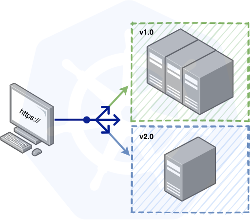
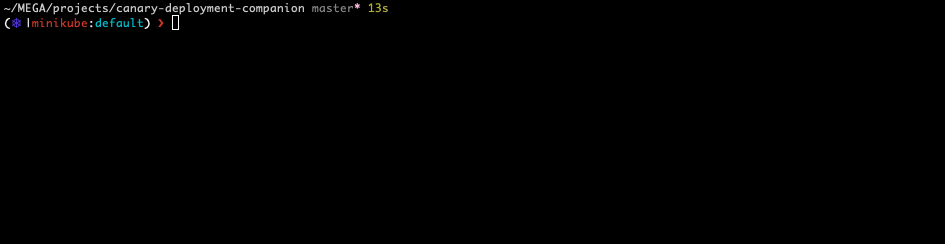
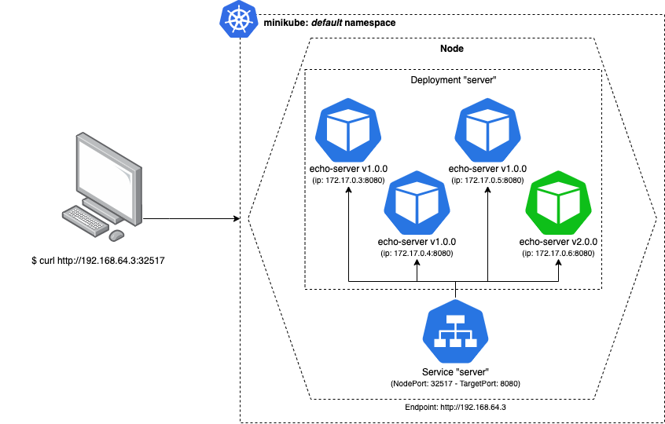
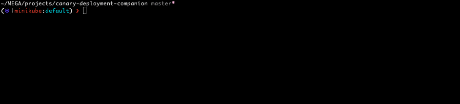
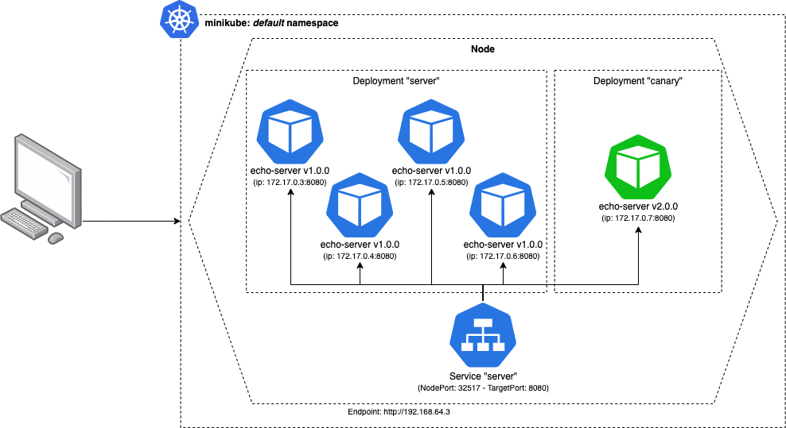

Its true, that if the time from developing a feature to deploying it to your customers only takes minutes to hours instead of days to months, that you probably have a pretty amazing development workflow.

Im also willing to bet that a key feature of that workflow is an impeccable CI/CD pipeline, that not only allows your development team to automate a lot of time consuming and manual tasks (like building, testing, deploying, etc) but also, shortens the feedback cycle between developing->testing and testing->production.

I would even say that in those cases, you have a delivery pipeline that most companies work really hard to achieve.

# Motivation

One of the major pain points that I see from working in Software for the last couple of years is that, even after all the work your team had developing and testing, making sure everything is working as expected, you still have to "schedule" a major deploy, nurture it while checking if no major problems occurs.

Most of the time, that is because we are not 100% confident that the feature will go "bug free" or that we wont cause an outage ou impact a dependency:
> eg: what would happen to our feature with a 10x increase in traffic?

Other times we just have to many operations involving the deployment.
> eg: migration scripts, feature flags, db schema upgrades, etc.

Although you are in an "agile company", you still need to "fill up a form" every time you push to production.

_If only there was a better way..._

# Overview

In this post, we're going to play around with a simple Canary Deployment workflow to maintain a test app on an Kubernetes cluster.

We will do this, in 2 parts:
1. Setup the test app, environment and make sure everything is up and running locally
2. Play around with different implementations of canary deployments on Kubernetes

The end goal is to have an idea of how to setup an automatic CI/CD pipeline that will allow us to:
* Shift a small subset of our traffic to the new deployed version of the app. This action will allow us to perform simple smoke tests to see if everything is up an running on the new version.
* Once we are certain the new version works well, we will shift gradually all traffic to it, allowing us to monitor how it works under load, and eventually decommissioning the old version.

💡 **By leveraging Kubernetes, we can implement a simple Canary Deployment strategy, that enables us to quickly get valuable feedback on our work, decreasing the feedback cycle and improving our confidence in our code.**

# Initial Environment Setup

> To keep this simple and light, you can download all this code from https://gitlab.com/andreffs18/canary-deployment-companion.

## Test Application

Our application is a simple HTTP Go server that logs it's version and returns it when we request the root endpoint:

```go
// ~/canary-deployment-companion/main.go
package main

import (
	"fmt"
	"log"
	"net/http"
	"os"
)

func main() {
	http.HandleFunc("/", func(w http.ResponseWriter, r *http.Request) {
		fmt.Fprintf(w, "version: %s", os.Getenv("VERSION"))
	})
	if err := http.ListenAndServe(":8080", nil); err != nil {
		log.Fatal(err)
	}
}
```

We can spin up this server and check that it is working as expected:
```bash
$ VERSION=v1.0.0 go run main.go
# Opening a browser on http://localhost:8080/
version: v1.0.0
```

We have an application! Now we need to create a docker image for it, so we can use it as a container in our cluster.

> For convenience, I've made this image available on my docker hub page https://hub.docker.com/r/andreffs/echo so you can skip this step if you want.

```dockerfile
# ~/canary-deployment-companion/Dockerfile
FROM golang:1.13.8-alpine3.11 as build
# Set the Current Working Directory inside the container
WORKDIR /go/src/github.com/andreffs18/echo
# Copy everything from the current directory to the one inside the container
COPY main.go .
# Build binary executable
RUN CGO_ENABLED=0 go build -ldflags="-s -w" -o /echo

# _Tis but a scratch_
FROM scratch
# Copy only binary file from previous stage
COPY --from=build /echo /echo
# This container exposes port 8080 to the outside world
EXPOSE 8080
# Define version so we can print it
ARG VERSION
ENV VERSION=$VERSION
# Run the executable
CMD ["/echo"]
```

Now, to build this image locally just:
```bash
$ docker build --build-arg VERSION="v1.0.0" -t andreffs/echo:v1.0.0 .
Sending build context to Docker daemon  58.88kB
Step 1/10 : FROM golang:1.13.8-alpine3.11 as build
 ---> e1fd9820be16
Step 2/10 : WORKDIR /go/src/github.com/andreffs18/echo
 ---> Running in b93c242e71b9
Removing intermediate container b93c242e71b9
 ---> 5d0917ad21d9
Step 3/10 : COPY main.go .
 ---> 98585cd2b9a3
Step 4/10 : RUN CGO_ENABLED=0 go build -ldflags="-s -w" -o /echo
 ---> Running in a49611010585
Removing intermediate container a49611010585
 ---> b3b9af095993
Step 5/10 : FROM scratch
 --->
Step 6/10 : COPY --from=build /echo /echo
 ---> e669809c7881
Step 7/10 : EXPOSE 8080
 ---> Running in 45a3b7be3823
Removing intermediate container 45a3b7be3823
 ---> 300a9f31c0be
Step 8/10 : ARG VERSION
 ---> Running in 1e22a6b73c37
Removing intermediate container 1e22a6b73c37
 ---> 18865fe5e6eb
Step 9/10 : ENV VERSION=$VERSION
 ---> Running in 9e7a3448f8fe
Removing intermediate container 9e7a3448f8fe
 ---> a4958410a246
Step 10/10 : CMD ["/echo"]
 ---> Running in 5c169b571faa
Removing intermediate container 5c169b571faa
 ---> 93120fb32f2a
Successfully built 93120fb32f2a
Successfully tagged andreffs/echo:v1.0.0
```

Your application is now stored in your local container registry, which you can access and run in docker:

```bash
$ docker images
REPOSITORY          TAG         IMAGE ID        CREATED               SIZE
andreffs/echo       v1.0.0      93120fb32f2a    About a minute ago    5.42MB

$ docker run --rm -it -p 8080:8080 andreffs/echo:v1.0.0
# Opening a browser on http://localhost:8080/
version:  v1.0.0
```

## Minikube Cluster

To test our examples we will be using [Minikube](https://minikube.sigs.k8s.io/docs/start/). This tool lets you instantiate a Kubernetes Cluster locally with no effort.

To do that, you first need to [install it](https://minikube.sigs.k8s.io/docs/start/) and then run the following:
```bash
$ minikube start --vm-driver=hyperkit
😄  minikube v1.16.0 on Darwin 10.14.6
✨  Using the hyperkit driver based on user configuration
👍  Starting control plane node minikube in cluster minikube
🔥  Creating hyperkit VM (CPUs=2, Memory=4000MB, Disk=20000MB) ...
🐳  Preparing Kubernetes v1.20.0 on Docker 20.10.0 ...
    ▪ Generating certificates and keys ...
    ▪ Booting up control plane ...
    ▪ Configuring RBAC rules ...
🔎  Verifying Kubernetes components...
🌟  Enabled addons: storage-provisioner, default-storageclass
🏄  Done! kubectl is now configured to use "minikube" cluster and "default" namespace by default
(⎈ |minikube:default) $
```

Now the fun part. Our cluster will consist of:
* A Deployment configuration that spins up 4 servers, running our "echo" server
* A Service configuration which exposes our "echo" servers through an HTTP endpoint.

It should look something like this once we have everything running:


Lets create a kubernetes configuration file named `stable.yml`, with the following:
```yml
# ~/canary-deployment-companion/k8s/stable.yml
---
apiVersion: apps/v1
kind: Deployment
metadata:
  name: server
  namespace: default
  labels: &labels
    app: echo
    track: stable
    version: v1.0.0
spec:
  replicas: 4
  selector:
    matchLabels: *labels
  strategy:
    rollingUpdate:
      maxUnavailable: 0
      maxSurge: 1
  template:
    metadata:
      labels: *labels
    spec:
      containers:
      - name: echo
        image: andreffs/echo:v1.0.0
        imagePullPolicy: IfNotPresent
        ports:
          - name: http
            containerPort: 8080
      restartPolicy: Always
```
>  All manifest files can be downloaded from https://gitlab.com/andreffs18/canary-deployment-companion

```bash
# Make sure you are running on your minikube cluster
$ kubectl config use-context minikube
Switched to context "minikube".

# Configure pods with deployment.yml manifest
(⎈ |minikube:default) $ kubectl apply -f stable.yml
deployment.apps/server created

# Expose pods via a Kubernetes service
(⎈ |minikube:default) $ kubectl expose deployment server --type=NodePort --port=8080
service/server exposed

# Open service on the default web browser
(⎈ |minikube:default) $ minikube service server
|-----------|--------|-------------|---------------------------|
| NAMESPACE |  NAME  | TARGET PORT |            URL            |
|-----------|--------|-------------|---------------------------|
| default   | server |        8080 | http://192.168.64.3:32517 |
|-----------|--------|-------------|---------------------------|
🎉  Opening service default/server in default browser...
```

At the same time, we will open a different terminal and run this one liner so we keep pinging our service. This will simulate traffic reaching our pods, so we can see on our logs which pod was executed.

```bash
(⎈ |minikube:default) $ while true; do curl $(minikube service server --url) && echo " ping"; sleep 2; done
```



With this setup we can start testing our different options 🎸.

# CI/CD Pipeline

We'll not build the actual CI/CD pipeline in this post, but you can apply all these concepts anyway.

Since the companion code is hosted on gitlab, an example of a Gitlab CI/CD configuration is used to illustrate how to setup the Canary Deployment.

## Pipeline Configuration

From an high level view, our CI/CD is composed of 4 stages:


stateDiagram-v2
[*] --> Build
Build --> Test
Test --> Canary
Canary --> Rollout
Rollout --> [*]
note right of Build
    Build project docker image
    and push it to Gitlab
      container registry
end note
note left of Test
    Run unit tests/functional tests
    on project and ensure code
    is working as expected
end note
note right of Canary
    Deploy to a % of your fleet
    the new code version
end note
note left of Rollout
    Deploy to all pods the new
    code changes
end note




This simply put can be translated into the following Gitlab `.gitlab-ci.yml` configuration:
```yml
# ~/canary-deployment-companion/.gitlab-ci.yml
stages:
  - build
  - test
  - canary
  - deploy

build:
  stage: build
  allow_failure: false
  script:
    # Build image with latest code changes and push it to Gitlab ECR
    - docker build --pull -t $IMAGE:$VERSION .
    - docker push $IMAGE:$VERSION

test:
  stage: test
  script:
    # Run all necessary unittest
    - echo "Starting test suit..."
    - sleep 1
    - echo "No test, no errors 🙃"

canary:
  stage: canary
  script:
    # Starting canary deployment for new version and monitor errors
    - scripts/canary-deploy.sh $IMAGE:$VERSION
    - scripts/monitor-errors.sh

deploy:
  stage: deploy
  needs: [canary]
  script:
    # Starting full rollout of new version and rolling back canary deployment
    - scripts/rollout-new-version.sh $IMAGE:$VERSION
  after_script:
    # Add tag "latest" to last pushed image
    - docker pull $IMAGE:$VERSION
    - docker tag $IMAGE:$VERSION $IMAGE:latest
    - docker push $IMAGE:latest
```

## Stages

Each stage will run one of the scripts that we have on our companion repo. This is just to keep the `.gitlab-ci.yml` easy to read and understand.

### Continuous Integration

**Build** and **Test** are pretty much straight forward:
* You build your container image so you can use it through your pipeline
* CI runs test suit on service to make sure no bugs were introduced and functionality is working

### Continuous Deployment

The **Canary** and **Rollout** its where we want to focus.

Below we go through the main ideas on how to develop those two steps: **How to deploy, orchestrated and monitor the canary deploy** and finally **how to rollout to the whole fleet** the new version of our server.

But first, lets figure out how to deploy the new version to just our `track: canary`.

# Canary Rollout

## Just "$ sed" you pod’s image

This is the “ugly but quick” way.

On Kubernetes [cheatsheet](https://kubernetes.io/docs/reference/kubectl/cheatsheet/#updating-resources), they show some examples on how to update resources. For this case, we want to just update **a single container pod's image version**.

The idea here would be to just manually run a replacement script on one of our available servers:

```bash
(⎈ |minikube:default) $ kubectl get pods
NAME                      READY   STATUS    RESTARTS   AGE
server-55c7c6d78f-4rsl7   1/1     Running   0          16h
server-55c7c6d78f-bh7pc   1/1     Running   0          16h
server-55c7c6d78f-cq98j   1/1     Running   0          16h
server-55c7c6d78f-z2zpk   1/1     Running   0          16h

(⎈ |minikube:default) $ kubectl get pod server-55c7c6d78f-z2zpk -o yml | sed 's/\(image: andreffs\/echo\):.*$/\1:v2.0.0/' | kubectl replace -f -
pod/server-55c7c6d78f-z2zpk replaced
```
You can see what would happen to our servers below: we would have made available a new "echo:v2.0.0" server, which means, we have **25% of our traffic using version 2.0.0**:



If we check out logs, we will see that change:


> Our "while loop ping" shows that around 1/4 of the time we have the v2.0.0 responding our request.

This is _quick and easy_ to test but its very limited. Its okay if you are doing this manually on a controlled environment with minimal/no risk, like locally. (I mean, not production 🙃)

Although the cons are still something to take into account:
* No traceability (only if you record your own actions, but who really does that?)
* Manual -> Error prone since you will forget how you did it, or just “half-ass it” because “I already did this, it was something like this!"
* The actual deployment configuration becomes outdated and does not reflect what we have configured

There is also the disadvantage that if you have problems with the new version and you want to rollback, you need to find the exact pod where we updated the image, and either:
* **Delete the pod:**
    * Kubernetes will take into account the deployment configuration, and see that we had configured **4** pods running v1.0.0. Since one was deleted, Kubernetes will take care of spinning up a new one.
    > ```bash
    > (⎈ |minikube:default) $ kubectl delete pod server-55c7c6d78f-z2zpk
    > pod "server-55c7c6d78f-z2zpk" deleted
    > (⎈ |minikube:default) ❯ kubectl get pods -w
    > NAME                      READY   STATUS    RESTARTS   AGE
    > server-55c7c6d78f-4rsl7   1/1     Running   0          7d13h
    > server-55c7c6d78f-bh7pc   1/1     Running   0          7d13h
    > server-55c7c6d78f-cq98j   1/1     Running   0          7d13h
    > server-55c7c6d78f-z2zpk   1/1     Running   3          7d13h
    > server-55c7c6d78f-z2zpk   1/1     Terminating   3          7d13h
    > server-55c7c6d78f-nx2zp   0/1     Pending       0          0s
    > server-55c7c6d78f-nx2zp   0/1     Pending       0          0s
    > server-55c7c6d78f-nx2zp   0/1     ContainerCreating   0          1s
    > server-55c7c6d78f-z2zpk   0/1     Terminating         3          7d13h
    > server-55c7c6d78f-nx2zp   1/1     Running             0          4s
    > ```

* **Update image again:**
    * Running the above command but with the original version.
    > ```bash
    > (⎈ |minikube:default) $ kubectl get pod server-55c7c6d78f-nx2zp -o yml | sed 's/\(image: andreffs\/echo\):.*$/\1:v1.0.0/' | kubectl replace -f -
    > ```

## Template your canary deployment

Instead of just applying changes to one pod, we can duplicate our original `stable.yml` configuration with some variables (eg: image version, labels, etc), call it `canary.yml` and use it to start up a new deployment with the new version.

This way we remove the last two downsides of our first example:


# ~/canary-deployment-companion/k8s/canary.yml
---
apiVersion: apps/v1
kind: Deployment
metadata:
  name: server
  namespace: default
  labels: &labels
    app: echo
    track: canary
    version: {{VERSION}}
spec:
  replicas: {{REPLICAS}}
  selector:
    matchLabels: *labels
  strategy:
    rollingUpdate:
      maxUnavailable: 0
      maxSurge: 1
  template:
    metadata:
      labels: *labels
    spec:
      containers:
      - name: echo
        image: {{IMAGE}}
        imagePullPolicy: IfNotPresent
        ports:
          - name: http
            containerPort: 8080
        restartPolicy: Always


> This kubernetes deployment file is very similar to the "stable" deployment file. The only difference is the number of replicas (which is zero) and it's labels (`track=canary`).

Defining our kubernetes manifests like this, in our CI/CD we can simply replace those [mustache variables](https://mustache.github.io/) and apply the updated template, **without manually changing our manifests** every time we do a deploy.

So, although we are still running a `sed` underneath, we are actually **updating the deployment configuration and not the existing running pods**.

On your CI/CD pipeline, you should only need to give those 3 environment variables, every time you deploy a new version.

```bash
(⎈ |minikube:default) $ sed's/{{VERSION}}/2.0.0/g; s/{{IMAGE}}/andreffs\/echo:2.0.0/g; s/{{REPLICAS}}/1/'canary.yml | kubectl apply -f -
```

This is very different from before because it will spin up a new Deployment which has a different set of Pods, **without touching the original deployment**.



This is great 🚀 !
* You get much less work to deploy new versions
* You follow your deployment standard with these templates
* Better control over the different running versions

### Labels

Labeling your deployments is very important. It allows you to search and select specific running versions of your app and act upon only that subset.

This can also be used later to show on some dashboard the amount of pods we have, in which track, with which version, etc.

#### Version

The **version** is just an indication of what image we are using in that deployment config. We could infer it from the "image"name, but its useful to also have it either on a kubernetes annotation or label.

#### Track

Its important that we have something to distinguish multiple deployments. We're labeling the **stable.yml** configuration with **"track: stable"** and **canary.yml** with **"track: canary"** so we can distinguish between them later.
> You can find this approach also explained on [kubernetes documentation](https://kubernetes.io/docs/concepts/cluster-administration/manage-deployment/#canary-deployments) about canary deployments.

# Orchestrate the deployment

So we've taken advantage of `$ sed` to replace variables that we templated on a new `canary.yml` configuration. The next step would have to be, orchestrating both tracks.

Simply put, the workflow that we want to achieve is:
* Deploy on the canary track the new server version
* Monitor its behavior for a specific amount of time to ensure no problems arises
* Once conformable with new version, rollout v2.0.0 to stable track


[
  {url: "minikube-apply-canary-slide1.png", description: "Initial state of our Minikube cluster."},
  {url: "minikube-apply-canary-slide2.png", description: "We apply our Canary configuration with one replica. One pod will spin up on <strong>\"track: canary\"</strong>.<br>We'll let our new track receive traffic and monitor its behavior"},
  {url: "minikube-apply-canary-slide3.png", description: "Once the monitor period finishes, we start the rollback of the new version to <strong>\"track: stable\"</strong>"},
  {url: "minikube-apply-canary-slide4.png", description: "Kubernetes takes care of only terminating the old pods, if the new ones are <strong>\"healthy\"</strong>"},
  {url: "minikube-apply-canary-slide5.png", description: "Eventually, all pods are running the new version so we can scale down our Canary track to zero pods once again."},
  {url: "minikube-apply-canary-slide6.png", description: "Deployed version 2.0.0 with success ✅"},
]



There are multiple strategies on how to rollout your new version:
* If you're shy about it, scale it to only one pod, monitor it yourself and only rollout when you fell conformable with it.
  * If you don't have a good monitoring system, maybe setup one pod that only you have access to, and run some manual E2E tests on it.
* Spin up a small % of pods (related to your whole fleet) and monitor how it behaves under load.
  * Be on the lookout for 5XX error or unexpected behavior from your users
* Using some sort feature-flag system, only allow access to the new version to a particular set of users.
  * You could start with only internal users (like yourself), or by region, browser/interface, etc.

The key point here is, **monitoring the rollout is very important**

# Monitoring

Well-chosen parameters are essential for a successful canary deployment. These types of deployments will only be fully automated if you have good, reliable, observability over your service infrastructure. You need be able to monitor the number of requests, responses status, queries to database (if applicable), etc.

What we want to achieve here it some form of automated monitoring so our canary stage must also:
* Continuously check that we don't detect any errors
* Once that grace period is over, we proceed with full rollout of the new version

**And this is all automatic!** 😁

Your CI/CD pipeline needs to monitor that all new instances from **"track: canary"** are performing well, **and if any error is detected, it must be rollback immediately!** Since this new machine will also be receiving real traffic, we want to minimize any possible impact to our customer.

Going back to our CI/CD Pipeline example, we manage to achieve this with the `scripts/monitor-errors.sh`:

# ~/canary-deployment-companion/.gitlab-ci.yml
canary:
  stage: canary
  script:
    # Starting canary deployment for new version and monitor errors
    - scripts/canary-deploy.sh $IMAGE:$VERSION
    - scripts/monitor-errors.sh

(...)

> There are multiple and much better ways to achieve this, but for learning these concepts, this simple script does the trick 😎

Also complementary to this, we can take advantage of the [Liveness and Readiness](https://kubernetes.io/docs/tasks/configure-pod-container/configure-liveness-readiness-startup-probes/) probes. These will check if our service was able to boot up correctly.

So on your `canary.yml` you need to add the following:


# ~/canary-deployment-companion/k8s/canary.yml
---
apiVersion: apps/v1
kind: Deployment
metadata:
  name: server
  namespace: default
  labels: &labels
    app: echo
    track: canary
    version: {{VERSION}}
spec:
  replicas: {{REPLICAS}}
  selector:
    matchLabels: *labels
  strategy:
    rollingUpdate:
      maxUnavailable: 0
      maxSurge: 1
  template:
    metadata:
      labels: *labels
    spec:
      containers:
      - name: echo
        image: {{IMAGE}}
        imagePullPolicy: IfNotPresent
        ports:
          - name: http
            containerPort: 8080
        livenessProbe:
          httpGet:
            path: /
            port: 8080
        readinessProbe:
          httpGet:
            path: /
            port: 8080
      restartPolicy: Always


The example above is a naive approach of checking if the newly deployed pods are "healthy" and ready to serve traffic. In a production environment it would be good to have different endpoints since:

* **LivenessProbe** is useful to check if your container should be restarted. It should check if your server is returning a 200 HTTP OK;
* **ReadinessProbe** checks if your container is ready to receive traffic.
> More on how to configure Liveness and Readiness probes can be found here: https://kubernetes.io/docs/tasks/configure-pod-container/configure-liveness-readiness-startup-probes/


## Known/Unknown problems

Of course, its always easier to check if a 5XX was introduced than some race conditions. The point that I want to make across here is that its possible to monitor known problems that can be checked in an automated way, saving a lot of engineer time and sanity.

For example: If we detect service degradation or worst results than the previous version (eg: slowed response times), then we rollback the upgraded server to their initial version.

## Traceability

I briefly mentioned the lack of traceability by running the `sed` command manually. What I meant before can be approached from two POV's:
* what was deployed (version, image, etc) and when
* who deployed and why

Well, I don't have a good solution here.

The problem I want to fix is that no manual deploys happen and for that to exist there must be incentive to prevent people from doing it, because `kubectl -f apply *.yml` its just too damn easy.

For the first one, we can take advantage of the [`--record`](https://kubernetes.io/docs/concepts/workloads/controllers/deployment/#checking-rollout-history-of-a-deployment) flag when we apply our kubernetes configurations. This will keep track of the command that was executed at the time.
We can also add annotations to our deployments, so we know extra metadata like, deployment date.

On the second one, the only solution I came up with was adding some type of notification system (ie: slack webhooks) to let us know about who/when/how those pipelines where triggered.

Simple enough and solved my problem.


# Conclusion

Finally, the last stage: deployment to production!

We have both tracks running, our monitoring period found no problems whatsoever, and our CI/CD finishes and deploys the new version to the whole fleet!

So, what we manage to achieve with the topics talked in here was:
* Having a fully automated CI/CD Pipeline that is triggered every time we push code to our repository;
  * Our pipeline `build`s a new image every time a change is pushed, and runs all `tests` to ensure all expected functionality is still running
* Then it deploys to a % of our fleet the new version and monitors for some amount of time, checking if expected errors occurs;
* Once that grace period is over, we rollout the new version to all our servers;
* Finally, we scale down our canary track for next deploy.

🚀

# Further Work

While working on this post, I found some other cool topics that could be a good starting point for a next, _version_, (wow) on this. Here is the list:
* Defining better heuristics to decide if any of the servers in the canary track are faulty (eg: db access, profiling http requests, run synthetics tests on canary);
* How to setup a Grafana dashboard to monitor the health of our rollout and best practices;
* Databases: entire books have been written on how to make database schema changes. The problem is the database must simultaneously work with the canary and the stable versions during the deployment. So, if we have breaking schema changes, we’re in trouble. We need to maintain backward compatibility as we make changes, which adds another layer of complexity.
* In this example we blindly accept any traffic to our canary instance. Another options could be to segment the traffic by some kind of flag (eg: setting up an header, based on location or via different url)

# Resources

Some links that helped me understand better this topics that I think should be here:
- [Canary Deployments - Kubernetes Docs](https://kubernetes.io/docs/concepts/cluster-administration/manage-deployment/#canary-deployments)
- [Rollback on DeamonSets - Kubernetes Docs](https://kubernetes.io/docs/tasks/manage-daemon/rollback-daemon-set/)
- [Kubernetes cheatsheet - Kubernetes Docs](https://kubernetes.io/docs/reference/kubectl/cheatsheet/)
- [Kubernetes Rollbacks - Learnk8s](https://learnk8s.io/kubernetes-rollbacks)
- [Two-phased Canary Rollout with Open Source Gloo - Kubernetes Blog](https://kubernetes.io/blog/2020/04/two-phased-canary-rollout-with-gloo/)
- [Kubernetes Canary deployments 🐤 for mere mortals - Google Cloud](https://medium.com/google-cloud/kubernetes-canary-deployments-for-mere-mortals-13728ce032fe)
- [Canary Deployments - Gitlab Docs](https://docs.gitlab.com/ee/user/project/canary_deployments.html)
- [Getting Started with Kubernetes Ingress-Nginx on Minikube](https://awkwardferny.medium.com/getting-started-with-kubernetes-ingress-nginx-on-minikube-d75e58f52b6c)
- [Kubernetes infra metrics](https://help.sumologic.com/Metrics/Kubernetes_Metrics)
- [Monitor CPU/Memory Usage of K8S in Prometheus](https://itnext.io/k8s-monitor-pod-cpu-and-memory-usage-with-prometheus-28eec6d84729)
- [A deep dive into kubernetes deployment strategies](https://dev.to/educative/a-deep-dive-into-kubernetes-deployment-strategies-2f7n)
- [Deployment using Gitlab CI/CD on Kubernetes Cluster at GCP](https://medium.com/faun/application-deployment-using-gitlab-ci-cd-on-managed-kubernetes-cluster-at-gcp-72b59496979c)


👋
