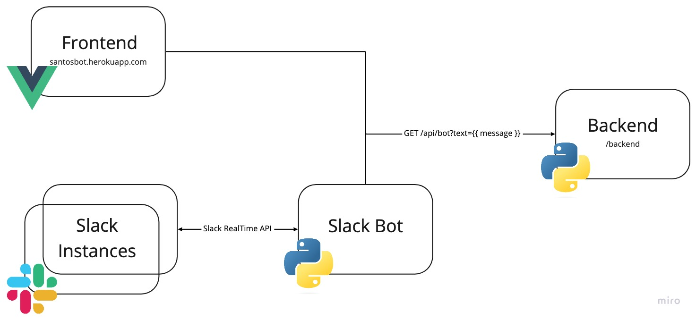
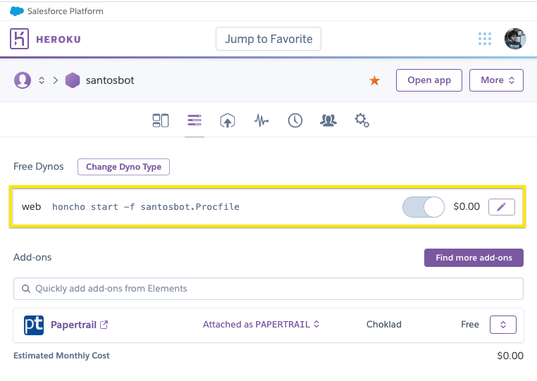
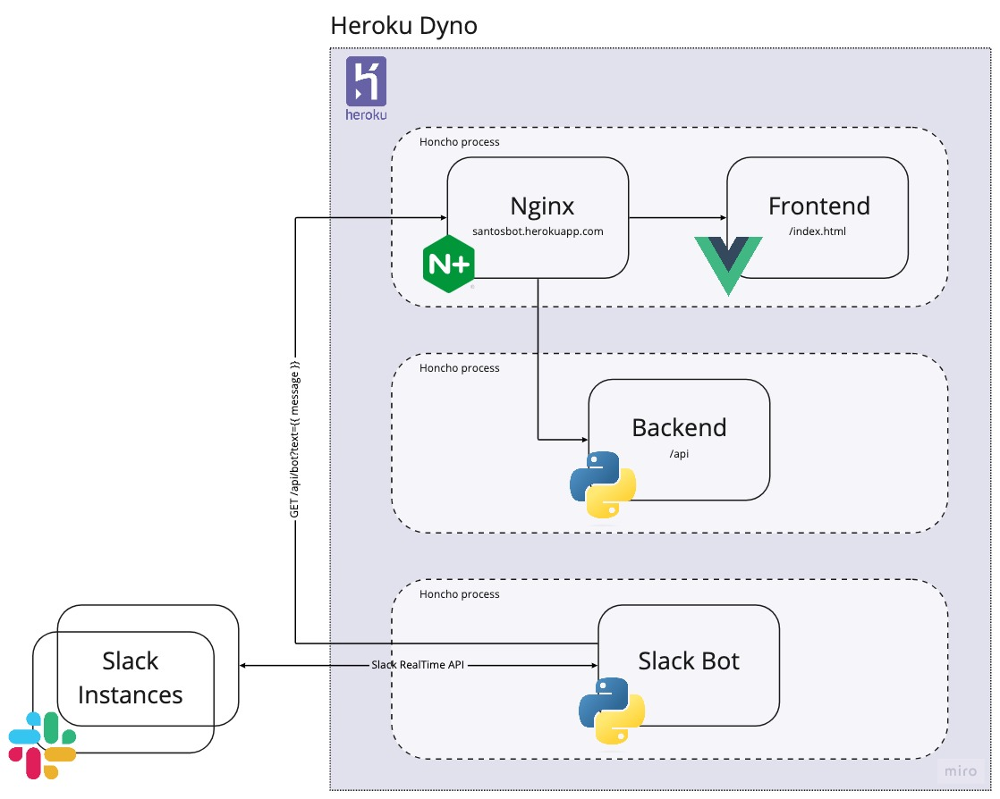
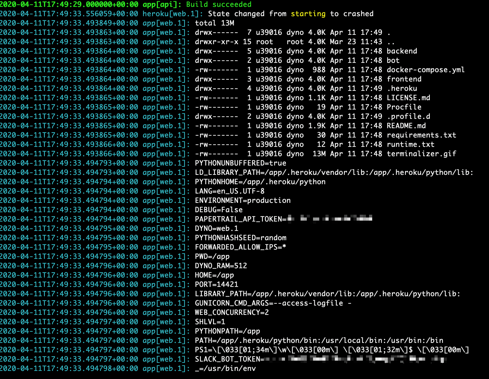
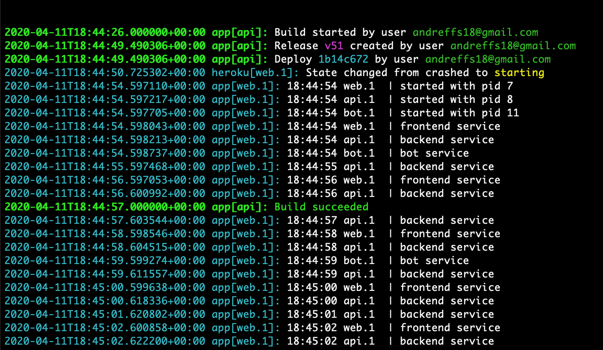

> Update 2022-09-25: Well damn... I guess I need to think of another way to do this.


-----


There is a Portuguese "motivational guru" called Gustavo Santos that has been in the news for some dumb reason. He's the type of character that will say something like "_A mente chama-se mente porque te mente_", and come off as super profound.
> "Mind is called mind because it _lies_"... in Portuguese sounds "better" 😅

Me and a couple of friends were talking about his books, quotes, tv shows, and _whell_... the guy must be doing something right if he's having all this success.

So, because I was playing with Slack's API and "slack bots are all the rage now", I decided to build one just to get a look at how it's done and, why not start with building a "Motivational Gustavo Santos Slack Bot".

In this post, I briefly talk about what the slack bot does, how it is built, and (the best part) how I manage to deploy three apps in Heroku without any cost.


# Idea

I want a bot that listens to certain keywords like "love", "mind" and "passion", and replies with a quote from Gustavo Santos. The high-level architecture for this is as follows:



* Frontend App: [VueJS](https://vuejs.org/guide/introduction.html) app that helps to showcase bot functionality. You can find it at http://santosbot.herokuapp.com/
* Backend API: Python ASGI web server ([FastAPI](https://fastapi.tiangolo.com/)) that exposes a Web API for getting quotes based on given input
* Slack Bot: Simple Python bot that uses [Real Time Messaging API](https://api.slack.com/rtm) from Slack, that listens to messages from the connected slack instance, which then interacts with the Backend API to post a quote.

> You can find the project here: https://github.com/andreffs18/santosbot

## Backend

The backend system just holds a dictionary with known quotes from [Gustavo Santos](http://www.citador.pt/frases/citacoes/a/gustavo-santos/1), and decides, based on the logic described below, what quote to use. Simply put, the logic behind the `"GET /api/bot?text={ message }"` endpoint is the following:


graph TD
    A[GET /bot?text=Hello World] --> B
    B[Get 'text' params from <br>request args and split<br> into 'tokens'] --> C
    C{Intersect 'tokens' <br>with 'TRIGGER_WORDS'}
    C --> |No intersection<br>found| D
    C --> |Found intersection| E
    D[Return empty quote]
    E[Get random 'TRIGGER_WORD'<br>from intersection] --> F
    F[Get random quote <br>associated with 'TRIGGER_WORD'] --> G
    G{Was the quote used in <br>the last X seconds?}
    G --> |Yes| D
    G --> |No| H
    H[Update 'last_used_at' date for given quote] --> I
    I[Return quote]


## Frontend

This part of the app was built for two simple reasons:
* Helps to show a "*slack-alike*" interface to showcase "Gustavo Santos" bot functionality, without having to install it
* I wanted to learn VueJS 🤓

It just interacts with the `"GET /api/bot?"` endpoint with the text we input on the form:


## Bot

It runs entirely on the [SlackClient](https://github.com/slackapi/python-slackclient) for Python by using the [Real Time Messaging Api](https://api.slack.com/rtm).

It's a simple "while loop" that iterates over all messages that are sent to the channel where the slack bot was added, and then it makes a request to the `GET /api/bot?` endpoint. If any quotes are returned then the bot posts them on the channel.
> In case you want to set it up for yourself, just follow the instructions here: https://github.com/andreffs18/santosbot/tree/master/bot


sequenceDiagram
    Slack Instance->>Bot: andreffs18: "Do you mind?"
    Bot->>Backend: GET /api/bot?text="Do you mind?"
    Backend->>Bot: HTTP 200 "Mind is called mind..."
    Bot-->>Slack Instance: santosbot: "Mind is called mind..."



# Deployment

This project is hosted on Heroku, on just one dyno! Yup, three apps, different languages, one dyno. You can check it on https://santosbot.herokuapp.com (it takes almost a minute to load) or here https://github.com/andreffs18/santosbot




## Rationale for this solution:

My idea is very simple: I want to deploy the whole project infrastructure on Heroku **without paying**.

Heroku has some restrictions, like:
* Only allows 2 dynos of different types per project (ie: one worker and one web)
* Configured by setting up "Builpacks", to define your dyno environment
> Buildpack is the way Heroku finds out which stack you are running:
> * Lifecycle [https://devcenter.heroku.com/articles/buildpack-api#bin-detect](https://devcenter.heroku.com/articles/buildpack-api#bin-detect)
> * Python [https://github.com/heroku/heroku-buildpack-python/blob/master/bin/detect](https://github.com/heroku/heroku-buildpack-python/blob/master/bin/detect)
> * Ruby [https://github.com/heroku/heroku-buildpack-ruby/blob/master/bin/detect](https://github.com/heroku/heroku-buildpack-ruby/blob/master/bin/detect)


While looking around the web, I found a couple of ways to achieve this:
* Use three dynos, one for each app (this means I pay 😟)
* Use one Heroku project, with one dyno, with three different apps (ie: multi deploy pipelines, also costly 😟)
  * Deploying multiple apps and then exposing them will cost me "time-money" and having two different pipelines to deploy one app seems hackish.

Although, I didn't find anything out there about another option, which is what I'm trying to do: **Use three apps within one dyno 😄.**

## Process management to the rescue


graph TD
    classDef one fill:#073d81,stroke:#031f41,stroke-width:2px,color:#fff;
    classDef two fill:#107cc5,stroke:#052c75,stroke-width:2px,color:#fff;
    classDef three fill:#8e8e8e,stroke:#4e4e4e,stroke-width:2px,color:#fff;

    A[How to deploy a multi-app in Heroku?]
    B[fa:fa-dollar Use one dyno per App]
    C[fa:fa-dollar Use Multi-deploy pipeline]
    D[fa:fa-smile-o Use process management]

    E["fa:fa-times Containerization (Docker Compose)"]
    F["fa:fa-check Process Management (Foreman)"]
    G[Nginx]

    A --> B
    A --> C
    A --> D

    D --> E
    D --> F
    F --> |Using| G

    class A one;
    class D two;
    class F three;



Going back to the "Procfile", and realizing that this is the process manager for the "web" or "worker" dynos, gave me an idea:

💡 I could set up one web dyno, as an entry point to a [Foreman](https://github.com/ddollar/foreman) script which would set up for me the different processes. Each would be looked after (in case of crashes or something) and I could just expose the right ports and connections that would make my app finally alive.

This would solve my main concern (only one project to run my whole app) plus an extra benefit: since Heroku charges you "dyno hours" (["*you have 1000 hours per month*"](https://help.heroku.com/8E2A2AIU/how-do-free-dyno-hours-work)), having three apps running is expensive "_in hours"_. This would prevent that!

While researching options on how to have multiple apps running in the same dyno, I end up categorizing them in two ways:
* Containerization (Docker): Using build pack and pulling from my registry (not really usable)
* Process Management (Foreman): Three apps running with **Nginx (the old savior) that port-forwards to all different processes**

> While researching this, I tried to set up all different processes to run on containers like "docker run ...". While trying to figure out this option, I discover that there is a service called [DockHero.io](https://dockhero.io/) that we can use, and since we just need the [buildpack](https://elements.heroku.com/buildpacks/dockhero/heroku-buildpack-docker-compose) to have access to our docker binaries we could use that instead. Although, as they state it pretty well: "IMPORTANT: in no way this buildpack helps you deploy your docker-compose.yml to Heroku Docker runtime"... so no luck here.

There are two big caveats to this second option:
1. Since Heroku runs with `systemd` on each dyno (process management on Ubuntu), this means if one of our processes fails, Heroku doesn't restart it. Only if the Nginx fails `systemd` will restart that instance.
> I still need to figure out how to bypass this limitation of this system. Maybe this could be another post 🤔...

2. It sucks to run the whole project since we need to install all requirements every time it boots up, which might become a problem if it takes [more than 60 seconds](https://tools.heroku.support/limits/boot_timeout)
> While you can [change this timeout](https://devcenter.heroku.com/articles/preboot) it is not advisable because:
> * If your app fails or crashes, Heroku will restart it and it will take all that time again to start up
> * If any requirement is missing, your app will continue to fail to start, staying on this endless loop

Still, the structure of the project becomes simpler, and to have all apps talk with each other, I just need to:
* Set up an Nginx app, working as a reverse proxy, that redirects all requests to the frontend app;
* All "/api" requests are proxied to the backend server;
* The actual bot is just running on a different process and connects to my slack account using [Slack RTM library](https://api.slack.com/rtm)

So, to manage all processes, and since I'm already using Python, I used [Honcho](https://honcho.readthedocs.io/en/latest/) (Foreman port to Python) to bypass the number of dynos restriction on Heroku.



The traffic is routed through a Nginx configuration, that you can configure by creating a [`"~/config/nginx.conf.erb"`](https://github.com/andreffs18/santosbot/blob/master/config/nginx.conf.erb) config file, and adding the following:


# part of the Nginx configuration
http {
  server {
    # Proxy pass ExpressJS Server.
    location  / {
      proxy_pass          http://127.0.0.1:8080;
      proxy_redirect      off;
      proxy_set_header    X-Forwarded-For $proxy_add_x_forwarded_for;
      proxy_set_header    Host $http_host;
    }

    # Proxy pass to Backend service
    location /api/ {
      proxy_pass          http://127.0.0.1:8888/;
      proxy_http_version  1.1;
      proxy_redirect      default;
      proxy_set_header    Upgrade $http_upgrade;
      proxy_set_header    Connection "upgrade";
      proxy_set_header    Host $host;
      proxy_set_header    X-Real-IP $remote_addr;
      proxy_set_header    X-Forwarded-For $proxy_add_x_forwarded_for;
      proxy_set_header    X-Forwarded-Host $server_name;
    }
  }
}



# Testing the multi-process hypotheses

To test this out, I wanted to just run some simple commands on the `Procfile: web`:

```bash
# ~/Procfile
$ ls -lha
$ env
```

This was the result:



> #fyi, if you are curious about the `.heroku` and `.profile.d` files, those are just folders with default configuration for setting up the dynos environments like the amount of memory available on the unicorn workers and set up of environment variables.


We have access to everything we need, let's test it out by creating a simple Procfile, one that simulates our services. Let's call it “santosbot.Procfile” and have just "echo's" for each service:

```bash
# ~/santosbot.Procfile
web: while true; do echo "frontend service"; sleep 2; done
api: while true; do echo "backend service"; sleep 1; done
bot: while true; do echo "bot service"; sleep 5; done
```

And to make sure nothing gets in the way, let's make sure no buildpacks are configured:

```bash
$ heroku buildpacks:clear
```
Now to test this, just push it and look at the logs:




Okay, _very nice_ 😎!

# Handling project dependencies

Since the project is divided into different folders, I first need to enter each one and then run the initialization script:

```bash
# ~/santosbot.Procfile
web: cd frontend && npm run build && npm run start
api: cd backend && uvicorn api:app --port 8888 --host 0.0.0.0
bot: cd bot && python main.py
```

_Annd_ right, we need to install all different dependencies for the different projects, which means running specific commands like `npm run build`. Since adding all of them into `~/santosbot.Procfile` means making some sort of "_this_":
```bash
web: cd frontend && EXPORT NODE_ENV=development && npm install && npm run build && npm run start...
```

I've abstracted that away and moved that initialization code into a `~/{ APP }/heroku.sh` file, located in each project folder:
```bash
$ tree ~/santosbot
.
├── Procfile
├── santosbot.Procfile
├── backend
│   ├── heroku.sh
│   └── (...)
├── bot
│   ├── heroku.sh
│   └── (...)
└── frontend
    ├── heroku.sh
    └── (...)
```


And so, our `~/santosbot.Procfile` can now look like this:

```bash
# ~/santosbot.Procfile
frontend: cd frontend && ./heroku.sh
backend: cd backend && ./heroku.sh
bot: cd bot && ./heroku.sh
```

With that, we just need to make sure we clear our buildpacks and set up the necessary ones:
* Python: To run our bot and backend service
* Node: To run our frontend app
* Nginx: To run the reverse proxy

```bash
# Don’t forget to Clear the buildpack and 
$ heroku stack:set heroku-18 --app santosbot
$ heroku buildpacks:clear
# Set all necessary buildpack configurations for the project dependencies
heroku buildpacks:add --index 1 https://github.com/heroku/heroku-buildpack-nginx.git
heroku buildpacks:add --index 2 heroku/python
heroku buildpacks:add --index 3 https://github.com/heroku/heroku-buildpack-nodejs#v170
# Just print the buildpack configuration
heroku buildpacks
```
> You can also just save those into your [`~/.buildpacks`](https://github.com/andreffs18/santosbot/blob/master/.buildpacks) file.

Next, we just need to set up Heroku runtime to be "Python" and install "Honcho".
This is done by creating a `~/runtime.txt` and `~/requirements.txt` files with the following:

```bash
# ~/runtime.txt
python-3.7.2
```

```bash
# ~/requirements.txt
honcho
```

Finally, you can add to your `~/Procfile` the necessary command to start the whole project:

```bash
# ~/Procfile
web: honcho start -f santosbot.Procfile
```


And that's it. This will take care of starting up your Dyno with Honcho as the Process manager, where it runs 3 processes:
* Nginx to forward the traffic between the frontend app and all other services (on port 8080)
* Backend app, running on port 8888, accepting traffic that comes from /api
* Bot app, running on another process and connected through the `SLACK_BOT_TOKEN` environment variable

# Conclusion

⚠️ This is by far an unsuitable "production system".

The goal I had with this blog post was to document my rationale while building this project, as well practice a bit my writing and my communication skills.

There is a lot of room to improve with this project. Maybe sometime in the future I can revamp this and start by fixing the startup time, which is a long time (ie: you need to refresh twice the page to be able to see the app).

I also need to find a better way to handle dependencies for each project. Since we need to install them every time the Heroku Dyno boots up, it makes the startup very slow.

Well, that's it for now. Thanks for reading :)

👋
