_Update 2022-08-16: Same thing as last year. Also, I finally managed to sell the whole collection. Need to pay for that dinner now :)_

_Update 2021-05-24: Went back to this to refresh with 2021 prices and check if those change that much after a year. Well, it seems it does_ 😂

-----

A good friend of mine gave me an old box of magic cards, like a _really_ big old box, and during the first couple of weeks of COVID, I decided to sort them out to see how much money I had in there.

> TL;DR the box had around 5K MTG cards with a total value of around 1,200€. If you want to check the spreadsheet feel free: https://docs.google.com/spreadsheets/d/1AY9tYBo2VmtG-y3E2Zinij17xSeoI0D4JC-rIwl-zRc/edit#gid=2119265541


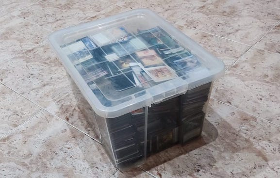


# Sorting and Cataloging

I started by scanning each card using [MTGoldFish](https://www.mtggoldfish.com/) website, but as you can imagine, that was painful. While looking for other options I came across [TCGPlayer](https://play.google.com/store/apps/details?id=com.tcgplayer.tcgplayer&hl=pt_PT&gl=US) App, which allows you to scan cards from your phone, like a cashier at the supermarket.

That seemed much simpler, so I downloaded the app, laid all the cards on my bed, and one by one started scanning those. This took around a week to do after work while watching [MR.Robot](https://www.tvtime.com/en/show/289590).

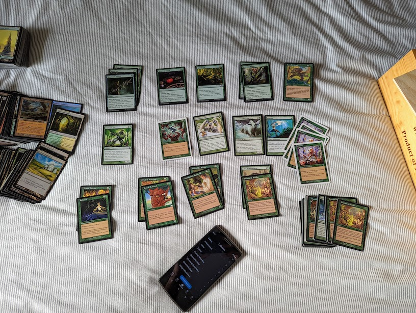

# Exporting the data

After a very long week, TCGPlayer had registered all +5k cards.

I wanted to check the price for my whole collection but since I could only check one by one manually, that was a problem.
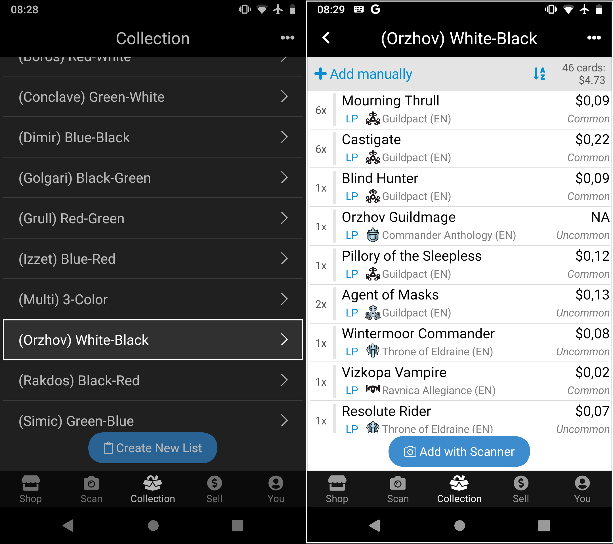

I started wondering that maybe there would be other places that might give me a better deal, like [MagicCardKingdom](https://www.cardkingdom.com/) or even [MTGoldFish](https://www.mtggoldfish.com/), and to know these, I would need to export my card collection. Also, since I planned on [selling _my_ cards](https://www.olx.pt/d/anuncio/5000-magic-the-gathering-mtg-card-collection-IDH8sWf.html), it could prove useful to have this collection available online so a possible buyer could see what it has.

Here's my problem: TCGPlayer doesn't allow you to do this. Reddit never fails in suggesting ["other options"](https://www.reddit.com/r/magicTCG/comments/2sud9v/tcgplayer_collection_exportdownload/) but moving all those collections from one app to another seems to be very cumbersome. In the end, it just sucks because I couldn’t export the whole collection.

So what do I do? My goal is to export the whole collection and put it in a nice spreadsheet so I can:
* Share it with people
* See different prices from different vendors
* Maybe eventually realize that all effort is not gonna pay off 🙃.

I could follow Reddit's idea of exporting all collections one by one, which would take ~5/10 seconds each, and then send them via email, which would make the whole process take like 20 seconds + download emails + import into spreadsheet + formatting (per collection )... _Oor_, I could just geek out and find a way to access the TCGPlayer App database on my phone, since that was something I never did before 🤓.

# Scrapping TCGPlayer data

So, first things first, I need to access my phone's internal storage and download all database/temporary files that TCGPlayer App creates to my laptop.

For me to do this I needed to "[Turn on developer options](https://developer.android.com/studio/debug/dev-options)" and set **"USB debugging" on**. Then connect the phone via USB and setup it up via **File Transfer**, and not that other **Media or PTP** stuff.

I also need to allow "Shell Root Access", and to do that (since my phone is a rooted OnePlus One) I can simply go to [magisk app](https://magiskmanager.com/) and allow that.

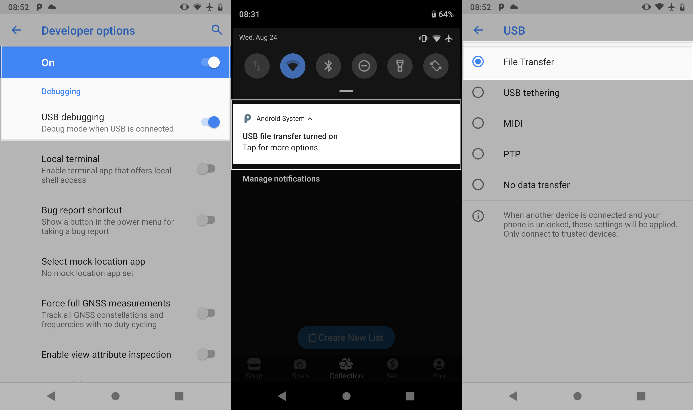

Alright, after that, I needed to install [**`adb`**](https://developer.android.com/studio/command-line/adb) (Android Debug Bridge) tool that allows me to access my phone via a terminal so I can find the internal files, and download them.
> On how to install `adb`, I just followed [this](https://stackoverflow.com/questions/31374085/installing-adb-on-macos) StackOverflow thread.

```bash
$ brew install android-platform-tools

$ adb root
adbd is already running as root

$ adb devices
List of devices attached
4a1e43b2  device
```


> ℹ️ Make sure you run it as "root" first. This will allow you to list and pull the data you need from your device, otherwise, you might get a "Permission denied" error.

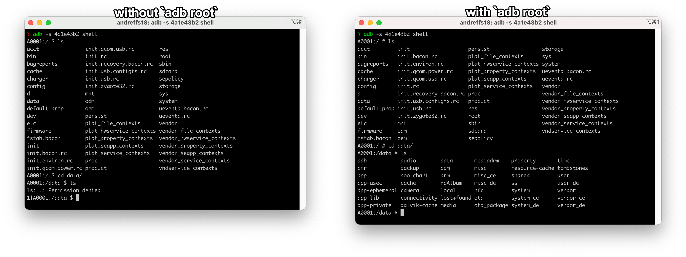


The next step is to figure out where TCGPlayer App stores its internal data. Once more, [StackOverflow](https://stackoverflow.com/questions/41498046/mac-android-studio-emulator-sqlite-database-actually-find-directory) strikes again, where we just need to pull the data from the `"/data/data/com.tcgplayer.tcgplayer"` folder.

```bash
$ cd /data/data/com.tcgplayer.tcgplayer
```

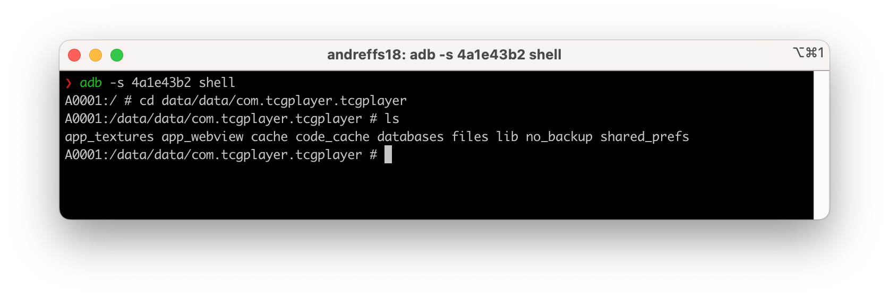

Finally, a simple `adb pull` can download the whole TCG folder:

```bash
$ adb pull /data/data/com.tcgplayer.tcgplayer myfolder
```

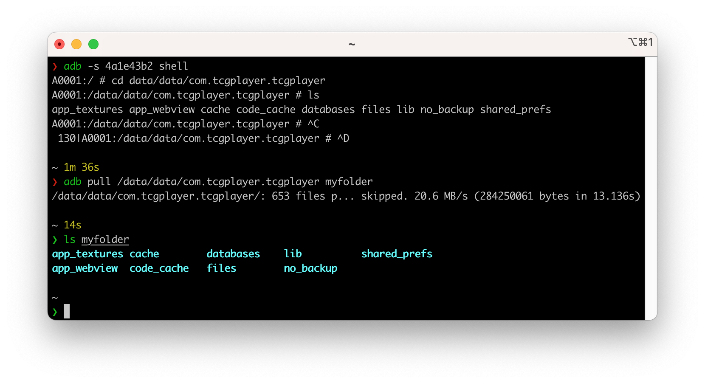

# Hello .sqlite


At this point, you can see that we found all internal files and that all scanned cards are stored in a couple of .sqlite databases.

We now need to query the data. Probably the best way to think about that query is to first understand the data model and go from there. A quick look over the different tables we have we can see that we are working with two files:

### userdata.sqlite
Has two tables: **"UserList"** and **"UserListCard"**, which seems to perfectly represent my custom collections ("Green-O", "White-A", etc) and the different scanned cards.

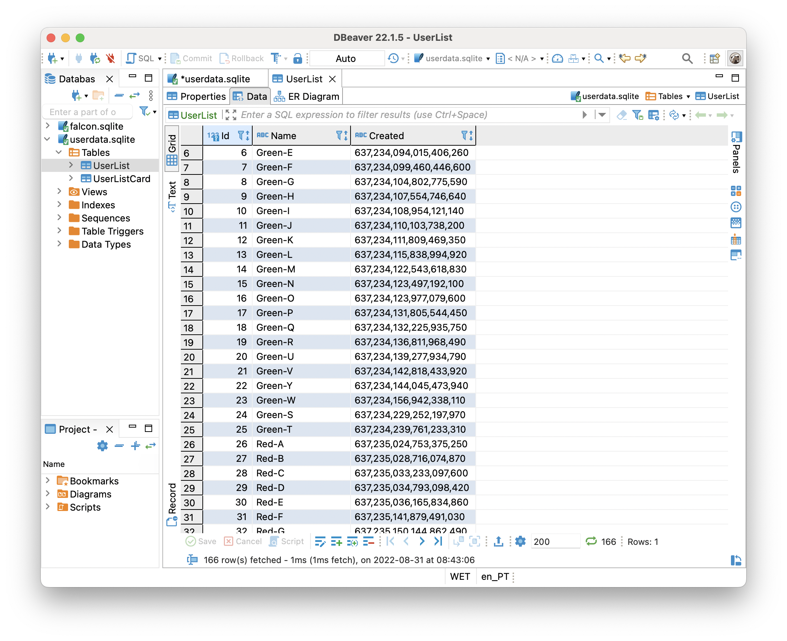

This is where our scanned cards live. We can double-check the amount by simply counting the number of rows:

```sql
SELECT COUNT(*) FROM UserListCard ul
>>> 3,377
```


### falcon.sqlite

This one has many more tables (15 to be exact), and looking at the ER model we can see some connections between them which highlights the different attributes of each card like language, rarity, and condition.

Checking the different tables we can confirm that it's just pre-populated card collections that the TCGPlayer app uses to do its thing.

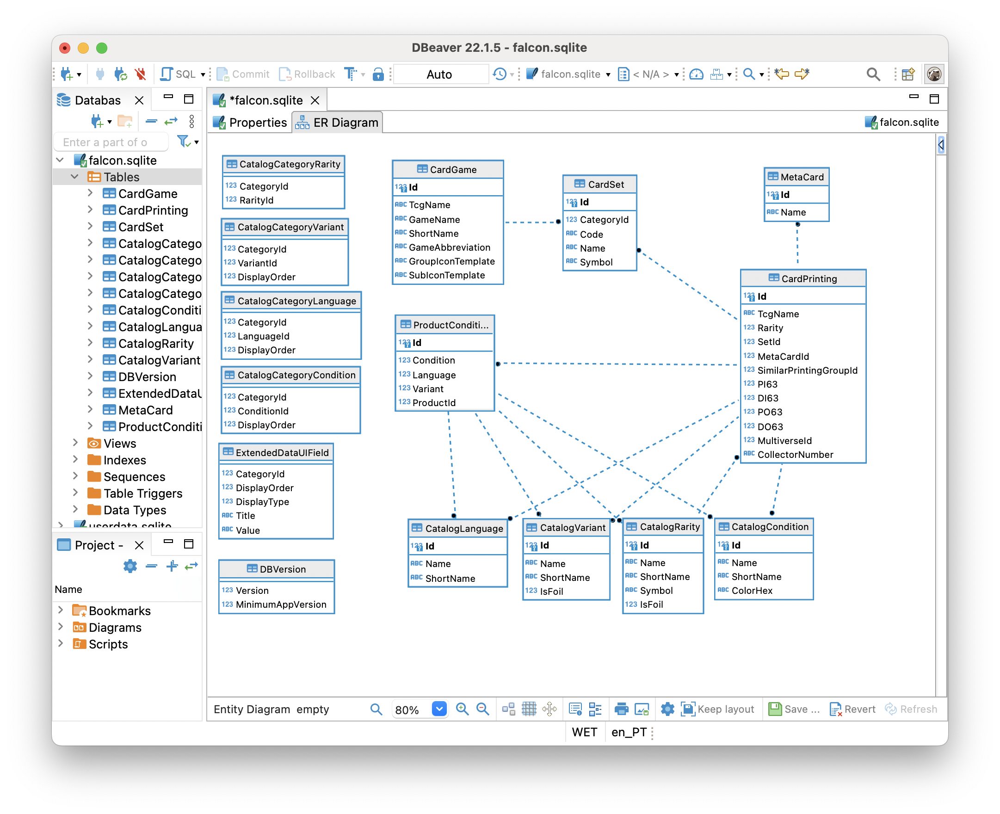


## Exporting the .csv

Basically, I need to join both `userdata.sqlite` and `falcon.sqlite` databases. With DBeaver we can simply export a query as a new table, and define the target location as a different database, which is pretty useful in this case.

So first, let's export _my_ personal card collection into a new table, with the columns that I need like like "productId" and "quantity":

```sql
SELECT UserListCard.Id, UserListCard.ListId, UserListCard.Quantity, UserListCard.ProductConditionId, UserListCard.ProductId, UserList.Name
FROM UserListCard
JOIN UserList ON UserListCard.ListId == UserList.Id
```

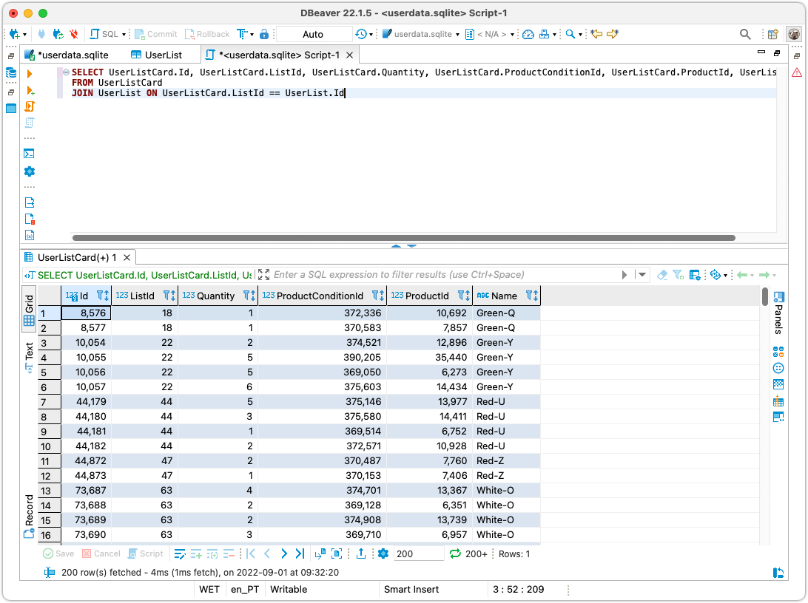


Using the "Export" button (1), an "Export Wizard" will pop up and we can follow the steps to convert the results from the query into a new table in `falcon.sqlite` database (2).


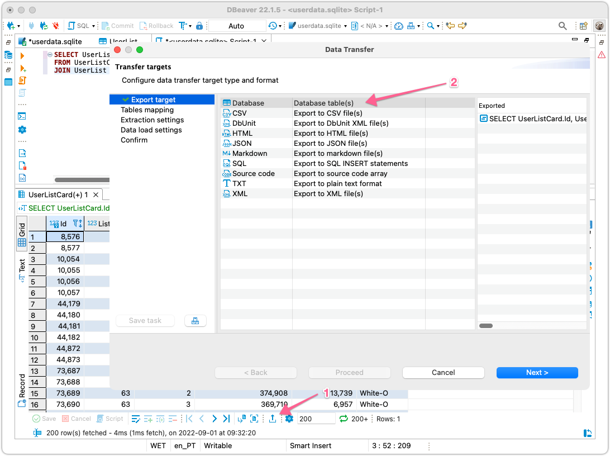


Once the process is completed, a new table will be created. I renamed it to "CardCollection" so it's easier to work with.

With that, we can see that the `falcon.sqlite` database ER diagram is updated!

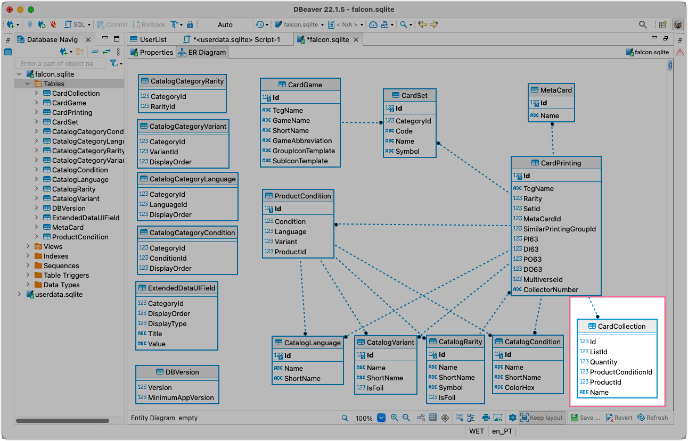

We have everything ready to generate our final .csv and using this ER model makes it very easy to extrapolate the query. The following query takes care of the job:

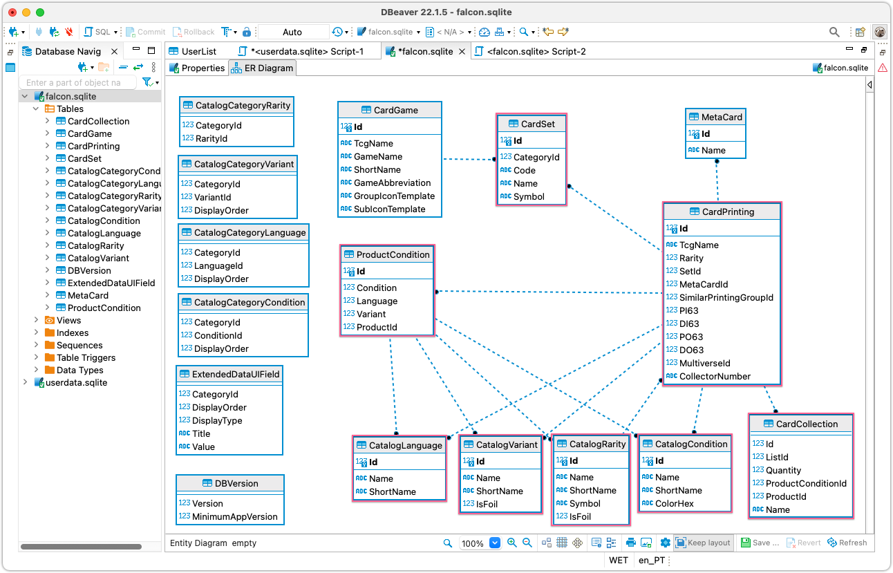

```sql
SELECT *
FROM CardCollection
INNER JOIN CardPrinting ON CardPrinting.Id = CardCollection.ProductId
INNER JOIN CardSet ON CardSet.Id = CardPrinting.SetId
INNER JOIN ProductCondition ON ProductCondition.Id = CardCollection.ProductConditionId
INNER JOIN CatalogCondition ON CatalogCondition.Id = ProductCondition.Condition
INNER JOIN CatalogLanguage ON CatalogLanguage.Id = ProductCondition.Language
INNER JOIN CatalogVariant ON CatalogVariant.Id = ProductCondition.Variant
INNER JOIN CatalogRarity ON CatalogRarity.Id = CardPrinting.Rarity
```


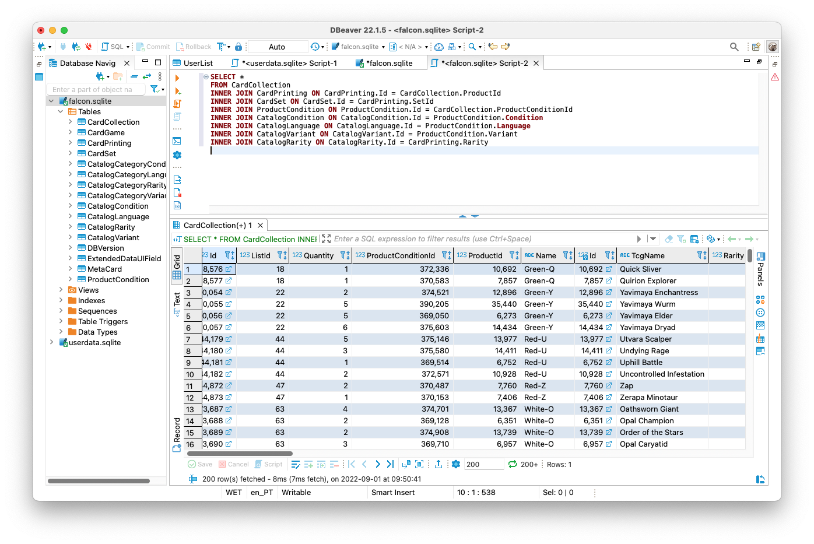


Great stuff! A simple "Export" to a .csv will do the work! 🚀


# Into a shareable spreadsheet

Finally 🍰.

Opening a browser tag and typing "[sheets.new](https://sheets.new)", and then "File > Importing > Upload" will move our exported .csv into a brand new, **shareable** spreadsheet which we can format accordingly.

To make it pretty, there is this great website ([eakett.ca](http://eakett.ca/mtgimage/#top)) where I found those SVG images by providing on the URL the mana or collection symbols. We just need to add a column to our spreadsheet with this snippet and that's it:

```c
=Image("http://eakett.ca/mtgimage/symbol/mana/" & LOWER(B4) & ".svg")
```

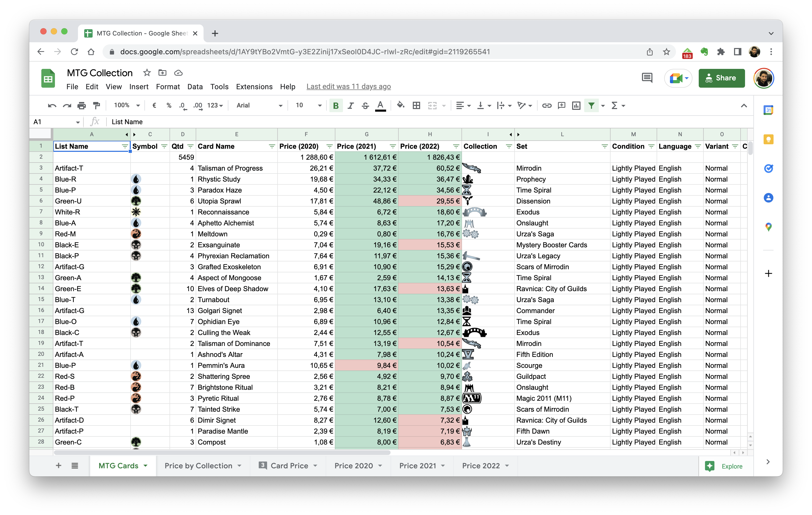

Again, if you wanna check the spreadsheet:
👉 https://docs.google.com/spreadsheets/d/1AY9tYBo2VmtG-y3E2Zinij17xSeoI0D4JC-rIwl-zRc/edit?usp=sharing 👈

# "You know what would be cool? An AI to find the best decks"

Since I initially wrote this blogpost, I've posted this on [Ebay](https://www.ebay.com/itm/185541996242?ViewItem=&item=185541996242) (and the Portuguese equivalent [Olx](https://www.olx.pt/d/anuncio/5000-magic-the-gathering-mtg-card-collection-IDH8sWf.html)) to see if I could sell it and buy my friend some fancy dinner.

I've shared it with a couple of friends as well which brought some interesting ideas like, using the data from the spreadsheet to have some type of AI to figure out the best decks from all these cards.

This idea *is not new* ([1](https://www.pyimagesearch.com/2021/03/03/an-interview-with-anthony-lowhur-recognizing-10000-yugioh-cards-with-computer-vision-and-deep-learning/), [2](https://www.reddit.com/r/magicTCG/comments/aa0u1d/is_there_a_mtg_deck_building_ai/), [3](http://www.shoeboxmtg.com/), [4](https://bestdeckforyou.pythonanywhere.com/)), but I couldn't find anything available to "plug and play" with this, or that it actually worked. Maybe something for the future 🧐.


# Resources:
* How to sell mtg cards: https://strategy.channelfireball.com/all-strategy/mtg/channelmagic-articles/how-to-sell-magic-cards/ and https://www.youtube.com/watch?v=7sV8F1qaFNc
* What did you guys automate in your life: https://www.reddit.com/r/Python/comments/miqt0d/what_did_you_guys_automate_in_your_life/
* Interview with Anthony Lowhur – Recognizing 10,000 Yugioh Cards: https://www.pyimagesearch.com/2021/03/03/an-interview-with-anthony-lowhur-recognizing-10000-yugioh-cards-with-computer-vision-and-deep-learning/
* Magic: The Gathering is Turing Complete: https://arxiv.org/abs/1904.09828

👋
