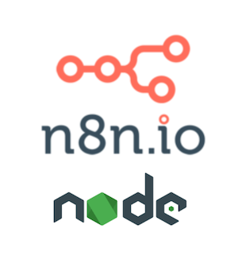
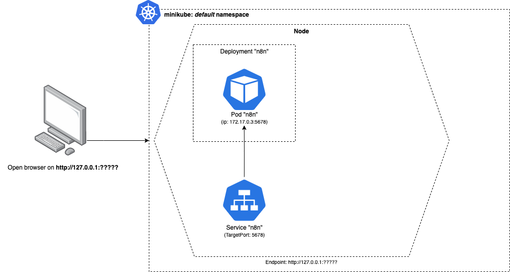
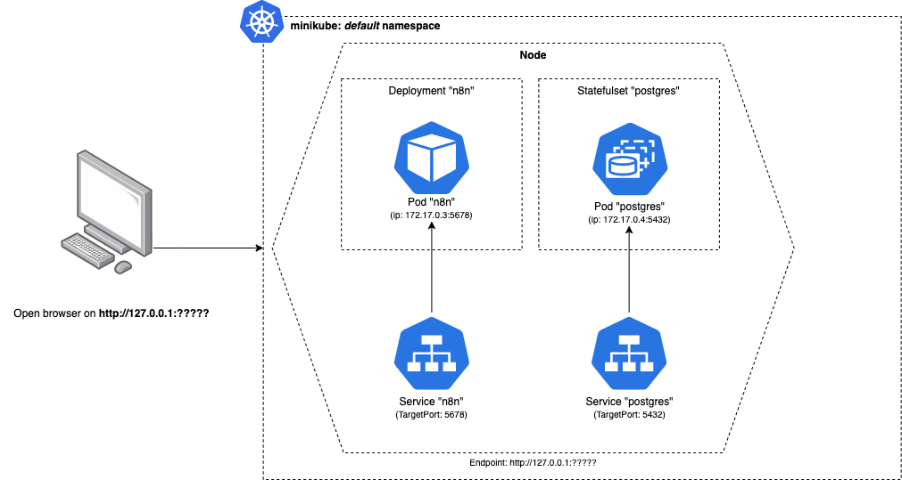
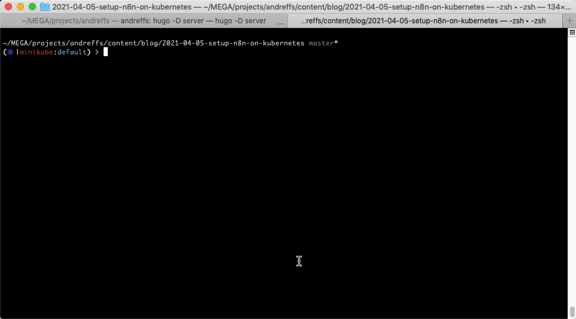

_Update 2021-05-23: Decided to split this post into 3 different ones to be more easily read. You can find the other two here: ["Observability on n8n"](/blog/observability-on-n8n/) and ["n8n customizations for Production"](/blog/n8n-customizations-for-production/)_.

-----

So at my company we started using [n8n](https://n8n.io/) to setup some MVP's, build workflows and glue together some of our internal tools in order to automate some of our processes.

In this post I'm going to go over how we've deployed n8n on our Kubernetes Cluster.

# What is n8n

Simply put, n8n is a free, extendable workflow automation tool, with a fair-code distribution model. If you already know no/low-code tools like [Zapier](https://zapier.com/) or [IFTTT](https://ifttt.com/), then n8n is pretty similar, and you can run it on your own.
> Being fair-code means that the source code will always be shared, and you are free to use. The only caveat is if you make money with n8n, then you might need to pay a license for using it. [This thread](https://community.n8n.io/t/doubts-about-fair-code-license/2502) on the community forum has good examples on why this model is different from the traditional "open-source" projects.



Under the hood it's a NodeJS web server that runs workflows. Since its inception ([~June 2019](https://github.com/n8n-io/n8n/commit/9cb9804eeec1576d935817ecda6bd345480b97fa)) it already has [+280 Nodes](https://n8n.io/integrations) and [+500 Workflows](https://n8n.io/workflows/) available. The community is very active as well, usually a fix takes a couple of days to get merged and deployed, which is very cool!
> This means that you can self-host n8n very easily. There is also [n8n.cloud](https://www.n8n.cloud/), the paid hosted version which you wont have to worry about scale, security or maintaining it by yourself.

## Why use n8n and not Zapier?

Well, for me, the high cost. 💸

Zapier is amazing and will probably work for whatever use-case throw at it, but over time the free tier just doesn't work. You hit your _"zap"_ limits very quickly and you can only create very simple "two-step" flows. More complex flows are only available for paying customers.


Also, its not on "your environment" (no on-premiss deployment/self-hosted) which might be a problem if you have strict rules in place, like sharing data with third party vendors. Zapier is enterprise ready, which means they will probably give you amazing customer support and all the features you need, you just need to 💰.

If don't mind setting up and managing your own instance (availability, scalability, durability, etc) then n8n will work as good as any of the non-free competitors.

### Example of a workflow between Zapier vs n8n

To illustrate the different between Zapier and n8n, here is a simple workflow comparison. Both workflows do the same thing:

_👉 &nbsp;Every hour, build a custom message and post it under my #general slack channel._
> This is just a simple workflow that allow us to quickly see the main differences.

For this to work we need:
* Some sort or routine/cronjob step, that is triggered every hour;
* A step to build our custom message;
* A slack integration to post our message.


Executing both workflows, we get the expected message on our slack channel:


But, the goal of this post is to not talk about why you should use n8n or Zapier, its actually to show you how we've setup n8n on our Kubernetes cluster.

So without further ado...

# How to setup n8n in Kubernetes

Instead of coming up from scratch with the whole Kubernetes configuration, we will be using the examples provided by [@bacarini](https://community.n8n.io/u/bacarini), a member of n8n's community forum that shared his [configuration](https://community.n8n.io/t/running-with-kubernetes/681/13), and a really good friend of mine.

The overall architecture will look something like the following:


[
  {url: "images/architecture-slide-1.png", description: "We're gonna use <a href='https://kubernetes.io/docs/tasks/tools/#minikube' target='_blank'>Minikube</a> for setting up our cluster locally. You can just follow the <a href='https://kubernetes.io/pt/docs/tutorials/hello-minikube/' target='_blank'>\"Hello World\"</a> tutorial if this is your first time using it."},
  {url: "images/architecture-slide-2.png", description: "First, we need to create our n8n instance. For that we need to setup one Deployment with one Pod. This container will use the <a href='https://hub.docker.com/r/n8nio/n8n/tags?page=1&ordering=last_updated' target='_blank'>\"n8nio/n8n:latest\"</a> image for now."},
  {url: "images/architecture-slide-3.png", description: "Secondly, n8n needs to store its configurations and workflows and since it already provides support for <a href='https://docs.n8n.io/reference/data/database.html#postgresdb'>PostgreSQL</a>, we will be using that. To support that new instance, we will need to configure a StatefulSet object."},
  {url: "images/architecture-slide-4.png", description: "Both instances need a couple of environments. We will also setup a Configmap and Secrets to save all of those."},
  {url: "images/architecture-slide-5.png", description: "Once those containers are running, we need to expose them. To do that we need to create a Service object for our n8n instance and expose it on the n8n default port (5678)."},
  {url: "images/architecture-slide-6.png", description: "The same thing for our Postgres instance. Since Postgres runs on the port 5432, we just need to setup a new Service but exposing that port instead."},
  {url: "images/architecture-slide-7.png", description: "Finally, we need to update our Secrets, particularly the <strong>\"Database Host\"</strong> configuration, so our n8n service knows how to communicate with out Postgres Service."},
  {url: "images/architecture-slide-8.png", description: "and run <code>\"$ minikube service n8n-service\"</code>. This will make minikube assign an available port on our host machine to our n8n Service, so we can access it on a browser."},
]


Once we have Minikube installed, we can start the cluster by running the following command:

```bash
$ minikube start --vm-driver=hyperkit
😄  minikube v1.16.0 on Darwin 10.14.6
✨  Using the hyperkit driver based on user configuration
👍  Starting control plane node minikube in cluster minikube
🔥  Creating hyperkit VM (CPUs=2, Memory=4000MB, Disk=20000MB) ...
🐳  Preparing Kubernetes v1.20.0 on Docker 20.10.0 ...
    ▪ Generating certificates and keys ...
    ▪ Booting up control plane ...
    ▪ Configuring RBAC rules ...
🔎  Verifying Kubernetes components...
🌟  Enabled addons: storage-provisioner, default-storageclass
🏄  Done! kubectl is now configured to use "minikube" cluster and "default" namespace by default

```

## n8n Deployment

Following the diagrams above, we will start with the n8n Deployment configuration and exposing it with its Service configuration:


# ~/k8s/n8n-deployment.yaml
---
apiVersion: apps/v1
kind: Deployment
metadata:
  name: n8n-deployment
  namespace: default
  labels: &labels
    app: n8n
    component: deployment
spec:
  replicas: 1
  selector:
    matchLabels: *labels
  template:
    metadata:
      labels: *labels
    spec:
      containers:
      - name: n8n
        image: n8nio/n8n:latest
        imagePullPolicy: IfNotPresent
        ports:
        - name: http
          containerPort: 5678
        envFrom:
        - configMapRef:
            name: n8n-configmap
        - secretRef:
            name: n8n-secrets
        livenessProbe:
          httpGet:
            path: /healthz
            port: 5678
        readinessProbe:
          httpGet:
            path: /healthz
            port: 5678
        resources:
          limits:
            cpu: "1.0"
            memory: "1024Mi"
          requests:
            cpu: "0.5"
            memory: "512Mi"




# ~/k8s/n8n-service.yaml
---
apiVersion: v1
kind: Service
metadata:
  name: n8n-service
  namespace: default
  labels:
    app: n8n
    component: service
spec:
  type: NodePort
  selector:
    app: n8n
    component: deployment
  ports:
  - protocol: TCP
    name: http
    port: 80
    targetPort: 5678



Important notes here:
* We assigned a `&labels` variable to help us from _copy&pasting_ the same labels everywhere inside the same .yaml configuration (this is replicated across most of our configurations);
* We are setting the n8n container port to **5678** on our **n8n-deployment.yaml** file, which maps to n8n default port. The container is exposed by our **n8n-service.yaml** on port **80** (http) by redirecting traffic from there to the containers **targetPort**.
* Both our **n8n-configmap.yaml** and **n8n-secrets.yaml** are associated with our n8n container, although we still need to create them. We'll do that shortly.
* n8n provides a [/healthz](https://github.com/n8n-io/n8n/commit/0214b44d513d47758ab677bd4a3a2efedb912110) endpoint to check if the service is up and running. We take advantage of that endpoint to configure our deployment Liveness and Readiness Probes;
* Finally, we top the resources of our container to use at best 1 CPU and 1Gbi of memory of our cluster.

Special attention to the **selector** on the **n8n-service.yaml** configuration which **must match the same labels on the n8n-deployment container**, otherwise we wont be able to reach our n8n server.
> To read more about selectors and how they work with Deployments you can go here: https://kubernetes.io/docs/concepts/workloads/controllers/deployment/#creating-a-deployment

So, applying both those configurations we will have the following:

```bash
$ kubectl apply -f k8s/n8n-deployment.yaml,k8s/n8n-service.yaml
deployment.apps/n8n-deployment created
service/n8n-service created
```



> If you went ahead and checked our pod (```$ kubectl get pods```), you will see that it is in a **"CreateContainerConfigError"** state. This is because we are still missing our ConfigMap and Secrets configuration. We will fix that soon.

## PostgreSQL StatefulSet

Very similar to our Deployment configurations before, the Postgres Statefulset configuration is as follows:


# ~/k8s/postgres-statefulset.yaml
---
apiVersion: apps/v1
kind: StatefulSet
metadata:
  name: postgres-statefulset
  namespace: default
  labels: &labels
    app: postgres
    component: statefulset
spec:
  serviceName: postgres-statefulset
  replicas: 1
  selector:
    matchLabels: *labels
  template:
    metadata:
      labels: *labels
    spec:
      containers:
      - name: postgres
        image: postgres:10
        ports:
        - name: postgres
          containerPort: 5432
        envFrom:
        - secretRef:
            name: postgres-secrets



# ~/k8s/postgres-service.yaml
---
apiVersion: v1
kind: Service
metadata:
  name: postgres-service
  namespace: default
  labels: &labels
    app: postgres
    component: service
spec:
  clusterIP: None
  selector:
    app: postgres
    component: statefulset
  ports:
  - name: postgres
    port: 5432
    targetPort: 5432


The main differences as you can see are:
* The port that we are exposing now, both in our **postgres-statefulset.yaml** and **postgres-service.yaml** is **5432**, which is the default port for a PostgreSQL server.
* Like the configuration before, special attention to the service selector which **must match the labels on the stateful set container**.

Applying both k8s configurations, and we have the following:

```bash
$ kubectl apply -f k8s/postgres-statefulset.yaml,k8s/postgres-service.yaml
statefulset.apps/postgres-statefulset created
service/postgres-service created
```



## ConfigMaps & Secrets

To tie these together we just need to bootstrap all default configurations for both n8n and PostgreSQL:

* Our n8n Deployment is linked to a ConfigMap by the name **"n8n-configmap"** and a Secrets configuration named **"n8n-secrets"**;
* The Postgres Statefulset is just by a Secrets configuration named **"postgres-secrets"**.


# ~/k8s/n8n-configmap.yaml
---
apiVersion: v1
kind: ConfigMap
metadata:
  name: n8n-configmap
  namespace: default
  labels:
    app: n8n
    component: configmap
data:
  NODE_ENV: "production"
  GENERIC_TIMEZONE: "Europe/Lisbon"
  WEBHOOK_TUNNEL_URL: "https://your.domain.com/"  # well come back to this later
  # Database configurations
  DB_TYPE: "postgresdb"
  DB_POSTGRESDB_USER: "n8n"
  DB_POSTGRESDB_DATABASE: "n8n"
  DB_POSTGRESDB_HOST: "postgres-service"
  DB_POSTGRESDB_PORT: "5432"
  # Turn on basic auth
  N8N_BASIC_AUTH_ACTIVE: "true"
  N8N_BASIC_AUTH_USER: "n8n"



# ~/k8s/n8n-secrets.yaml
---
apiVersion: v1
kind: Secret
type: Opaque
metadata:
  name: n8n-secrets
  namespace: default
  labels:
    app: n8n
    component: secrets
stringData:
  # Database password
  DB_POSTGRESDB_PASSWORD: "n8n"
  # Basic auth credentials
  N8N_BASIC_AUTH_PASSWORD: "n8n"
  # Encryption key to hash all data
  N8N_ENCRYPTION_KEY: "n8n"


-----


# ~/k8s/postgres-secrets.yaml
---
apiVersion: v1
kind: Secret
type: Opaque
metadata:
  name: postgres-secrets
  namespace: default
  labels:
    app: postgres
    component: secrets
stringData:
  PGDATA: "/var/lib/postgresql/data/pgdata"
  POSTGRES_USER: "n8n"
  POSTGRES_DB: "n8n"
  POSTGRES_PASSWORD: "n8n"


All these configurations are pretty standard, and most of them are copy&pasted from the example given by [@bacarini](https://community.n8n.io/t/running-with-kubernetes/681/13) or by [n8n documentation](https://docs.n8n.io/reference/configuration.html), but again the important part is:
* the **"DB_POSTGRESDB_HOST"** on the **n8n-configmap.yaml** configuration **must match the service name** for our PostgreSQL service.

Also, we need to update our `WEBHOOK_TUNNEL_URL` environment. This will be used mostly to call webhooks but it needs to be a valid host url, so it wont work.

Following n8n FAQ's they suggest to [use ngrok and setup that url](https://docs.n8n.io/credentials/twist/#how-to-configure-the-oauth-credentials-for-the-local-environment), but I found out that you can simply setup that config with the result of `$ minikube service n8n-service --url` and that will work without any extra service running on your computer.


# ~/k8s/n8n-configmap.yaml
---
apiVersion: v1
kind: ConfigMap
metadata:
  name: n8n-configmap
  namespace: default
  labels:
    app: n8n
    component: configmap
data:
  WEBHOOK_TUNNEL_URL: "http://192.168.64.7:32495/"
  (...)


Now, we can just apply all 3 configuration files, and **restart** both Deployment and Statefulset so these configurations are reloaded:

```bash
$ kubectl apply -f k8s/n8n-configmap.yaml,k8s/n8n-secrets.yaml,k8s/postgres-secrets.yaml
configmap/n8n-configmap created
secret/n8n-secrets created
secret/postgres-secrets created

$ kubectl rollout restart statefulset postgres-statefulset
statefulset.apps/postgres-statefulset restarted

$ kubectl rollout restart deployment n8n-deployment
deployment.apps/n8n-deployment restarted

$ kubectl get all
NAME                                  READY   STATUS    RESTARTS   AGE
pod/n8n-deployment-7ff699757b-hhnrl   1/1     Running   0          63s
pod/postgres-statefulset-0            1/1     Running   0          63s

NAME                       TYPE        CLUSTER-IP       EXTERNAL-IP   PORT(S)        AGE
service/kubernetes         ClusterIP   10.96.0.1        <none>        443/TCP        33m
service/n8n-service        NodePort    10.101.189.224   <none>        80:30758/TCP   29m
service/postgres-service   ClusterIP   None             <none>        5432/TCP       26m

NAME                             READY   UP-TO-DATE   AVAILABLE   AGE
deployment.apps/n8n-deployment   1/1     1            1           21m

NAME                                        DESIRED   CURRENT   READY   AGE
replicaset.apps/n8n-deployment-7ff699757b   1         1         1       63s

NAME                                    READY   AGE
statefulset.apps/postgres-statefulset   1/1     18m
```

### "n8n <> postgres" service

When creating a Service in Kubernetes, we can reach that Service by using its **fully qualified domain name** (FQDN) or, if the service is in the same namespace, just its **service name**.

For example, our `postgres-service` can also be reached by `postgres-service.default.svc.cluster.local`.

👉  **Its with this name that our n8n pod will communicate with our PostgreSQL database.**

> To learn more about service names in Kubernetes and its rules, check this: https://kubernetes.io/docs/concepts/services-networking/dns-pod-service/

## All together now 🚀

If you have been saving those configurations above you should have something like this in your working directory:


$ ls -lha k8s/
drwxr-xr-x  9 andresilva  staff   288B Apr 6 16:51 .
drwxr-xr-x  6 andresilva  staff   192B Apr 6 16:51 ..
-rw-r--r--@ 1 andresilva  staff   797B Apr 6 17:54 n8n-configmap.yaml
-rw-r--r--@ 1 andresilva  staff   998B Apr 6 16:51 n8n-deployment.yaml
-rw-r--r--@ 1 andresilva  staff   332B Apr 6 17:54 n8n-secrets.yaml
-rw-r--r--@ 1 andresilva  staff   369B Apr 7 23:13 n8n-service.yaml
-rw-r--r--@ 1 andresilva  staff   279B Apr 6 17:55 postgres-secrets.yaml
-rw-r--r--@ 1 andresilva  staff   283B Apr 6 16:55 postgres-service.yaml
-rw-r--r--@ 1 andresilva  staff   507B Apr 6 16:55 postgres-statefulset.yaml


> You could just deploy all configurations as a whole by simply running `$ kubectl apply -f .`

So the moment we've been working for: **to open our n8n server on our browser!**
```bash
$ minikube service n8n-service
|-----------|-------------|-------------|---------------------------|
| NAMESPACE |    NAME     | TARGET PORT |            URL            |
|-----------|-------------|-------------|---------------------------|
| default   | n8n-service | http/80     | http://192.168.64.7:32495 |
|-----------|-------------|-------------|---------------------------|
🎉  Opening service default/n8n-service in default browser...
```



And like that, you have n8n running in your own Kubernetes Cluster!! 🤩

# Resources

* n8n open-source vs fair-code: https://docs.n8n.io/reference/faq.html#which-license-does-n8n-use
* Examples on fair-code use: https://community.n8n.io/t/doubts-about-fair-code-license/2502
* How Kubernetes selector works: https://kubernetes.io/docs/concepts/workloads/controllers/deployment/#creating-a-deployment
* Kubernetes Service Names: https://kubernetes.io/docs/concepts/services-networking/dns-pod-service/
* Liveness and Readiness probes: https://kubernetes.io/docs/tasks/configure-pod-container/configure-liveness-readiness-startup-probes/

👋
