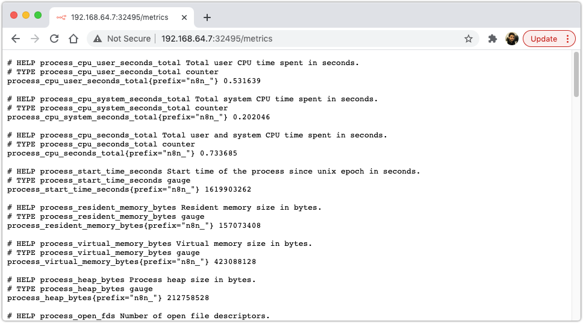
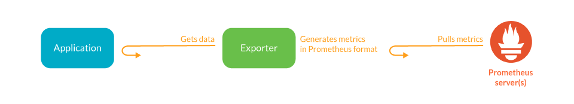
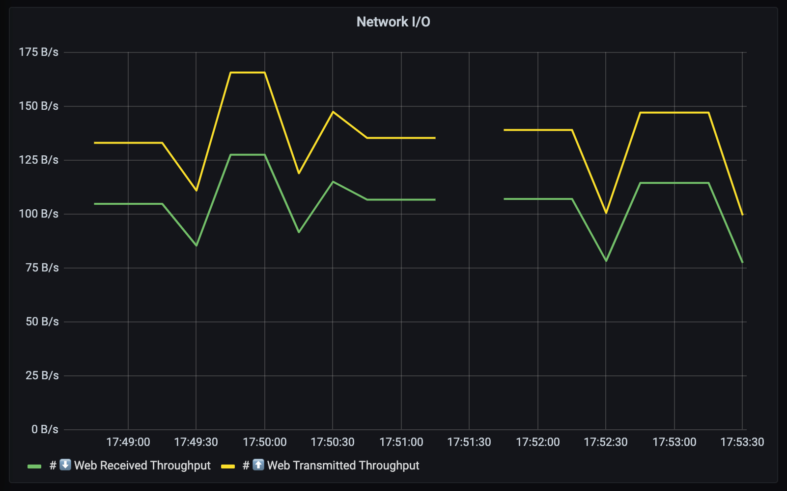

_This post is a continuation on ["Setup n8n on Kubernetes"](/blog/setup-n8n-on-kubernetes), so most of the things we talk here assume that you've followed/read this one as well._

-----

You have your own n8n instance running in Kubernetes, taking advantage of all amazing functionality and capabilities of it, but you are still going in blind right now. I mean, how can you check if your service is healthy? Is it running? How much memory is it using? 🤔

Since version [@0.111.0](https://github.com/n8n-io/n8n/releases/tag/n8n%400.111.0) n8n has the ability to expose its metrics from a **"/metrics"** endpoint. This is great because with that we can setup a Grafana dashboard, reading from a Prometheus data source, which scrapes all containers in our Kubernetes cluster emitting metrics from, you guess it, a _"/metrics"_ endpoint 😁.
> If you want to check how we've done that, feel free: https://github.com/n8n-io/n8n/pull/1515

So, as [the documentation](https://docs.n8n.io/reference/configuration.html#prometheus) explains, we just need to update our n8n configuration to have the following extra environment variable:


# On our ~/k8s/n8n-configmap.yaml
---
apiVersion: v1
kind: ConfigMap
metadata:
  name: n8n-configmap
  namespace: default
  labels:
    app: n8n
    component: configmap
data:
  NODE_ENV: "production"
  (...)
  # Emit metrics from n8n service
  N8N_METRICS: "true"


And restart our n8n deployment so these changes take effect:

```bash
$ kubectl rollout restart deployment n8n-deployment
```
> There are other options related to how n8n can emit metrics, which you can check here: https://docs.n8n.io/reference/configuration.html#prometheus

If we go again to your browser and check the "/metrics" endpoint, we should see something like this:



This by itself is not that useful... although, we can go a step forward and setup a dashboard with this information. 🚀

# Show in Grafana

We will save ourselves some time and just use [helm](https://helm.sh/docs/), which basically is a package manager for Kubernetes. It helps us with installing most of what we need to make this work.

To install it, we can just run this:

```bash
$ brew install helm
```

For this example we will install both Grafana and Prometheus, but in a different namespace just so we don't end up with to much stuff on our **default** one (it's also good practice to create different namespaces for specific use cases 🙌  ).

```bash
$ kubectl create namespace monitoring
namespace/monitoring created
```

## Install Grafana + Prometheus helm charts

Following Prometheus [installation guide](https://prometheus.io/docs/prometheus/latest/installation/) we can just add the corresponding helm charts and install our requirements:

```bash
$ helm repo add prometheus-community https://prometheus-community.github.io/helm-charts
$ helm repo add grafana https://grafana.github.io/helm-charts
$ helm -n monitoring install prometheus prometheus-community/prometheus
$ helm -n monitoring install grafana grafana/grafana
```

To check that everything is up and running, we can just `kubectl get all`, like so:

```bash
$ kubectl -n monitoring get all
NAME                                                 READY   STATUS    RESTARTS   AGE
pod/grafana-55777c78b6-9nhhp                         1/1     Running   0          18s
pod/prometheus-alertmanager-ccf8f68cd-5cjs7          1/2     Running   0          23s
pod/prometheus-kube-state-metrics-685b975bb7-z46f4   1/1     Running   0          23s
pod/prometheus-node-exporter-4klz5                   1/1     Running   0          23s
pod/prometheus-pushgateway-74cb65b858-zp8gk          1/1     Running   0          23s
pod/prometheus-server-d9fb67455-7pv4m                1/2     Running   0          23s

NAME                                    TYPE        CLUSTER-IP       EXTERNAL-IP   PORT(S)    AGE
service/grafana                         ClusterIP   10.107.166.24    <none>        80/TCP     18s
service/prometheus-alertmanager         ClusterIP   10.100.52.188    <none>        80/TCP     23s
service/prometheus-kube-state-metrics   ClusterIP   10.98.71.76      <none>        8080/TCP   23s
service/prometheus-node-exporter        ClusterIP   None             <none>        9100/TCP   23s
service/prometheus-pushgateway          ClusterIP   10.104.143.114   <none>        9091/TCP   23s
service/prometheus-server               ClusterIP   10.111.230.177   <none>        80/TCP     23s

NAME                                      DESIRED   CURRENT   READY   UP-TO-DATE   AVAILABLE   NODE SELECTOR   AGE
daemonset.apps/prometheus-node-exporter   1         1         1       1            1           <none>          23s

NAME                                            READY   UP-TO-DATE   AVAILABLE   AGE
deployment.apps/grafana                         1/1     1            1           18s
deployment.apps/prometheus-alertmanager         0/1     1            0           23s
deployment.apps/prometheus-kube-state-metrics   1/1     1            1           23s
deployment.apps/prometheus-pushgateway          1/1     1            1           23s
deployment.apps/prometheus-server               0/1     1            0           23s

NAME                                                       DESIRED   CURRENT   READY   AGE
replicaset.apps/grafana-55777c78b6                         1         1         1       18s
replicaset.apps/prometheus-alertmanager-ccf8f68cd          1         1         0       23s
replicaset.apps/prometheus-kube-state-metrics-685b975bb7   1         1         1       23s
replicaset.apps/prometheus-pushgateway-74cb65b858          1         1         1       23s
replicaset.apps/prometheus-server-d9fb67455                1         1         0       23s
```

## Exposing Grafana Dashboard

So right now both our services are not exposed. For example, in order for us to access Grafana we need to _port-forward_ to the service:


$ kubectl -n monitoring port-forward services/grafana 8000:80
Forwarding from 127.0.0.1:8000 -> 3000
Forwarding from [::1]:8000 -> 3000
Handling connection for 8000


Instead, we can just change our service type form **ClusterIP** to **NodePort**.
> If you want to understand better what types of Kubernetes services exist, [this blogpost](https://medium.com/google-cloud/kubernetes-nodeport-vs-loadbalancer-vs-ingress-when-should-i-use-what-922f010849e0) explains it perfectly!

There are a couple ways to get this done, we can:

#### 1️⃣ Create a new service which has type NodePort

With this solution we end up with two services;


$ kubectl -n monitoring expose deployment grafana --type=NodePort --target-port=9090 --name new-grafana
service/new-grafana exposed

$ kubectl -n monitoring get services | grep grafana
grafana                         ClusterIP   10.105.124.167   <none>        80/TCP                        20m
new-grafana                     NodePort    10.109.115.231   <none>        80:30361/TCP,3000:31399/TCP   2m43s


#### 2️⃣ Delete and create a new one;


$ kubectl -n monitoring delete service grafana
service "grafana" deleted

$ kubectl -n monitoring expose deployment grafana --type=NodePort --target-port=9090
service/grafana exposed

$ kubectl -n monitoring get services | grep grafana
grafana                         NodePort    10.104.74.196    <none>        80:30287/TCP,3000:32521/TCP   11s


#### 3️⃣ Update the existing one.

Which I've end up preferring:


$ kubectl -n monitoring patch service grafana -p '{"spec": {"type": "NodePort"}}'
service/grafana patched

$ kubectl -n monitoring get services | grep NodePort
grafana                         NodePort    10.107.166.24    <none>        80:30732/TCP   45s


This means that we now have a dedicated port on our host machine to access these services:


$ minikube -n monitoring service grafana
|------------|---------|-------------|---------------------------|
| NAMESPACE  |  NAME   | TARGET PORT |            URL            |
|------------|---------|-------------|---------------------------|
| monitoring | grafana | service/80  | http://192.168.64.7:30732 |
|------------|---------|-------------|---------------------------|
🎉  Opening service monitoring/grafana in default browser...


## Connecting Grafana to Prometheus data source

Finally, we just need to configure Grafana to use Prometheus as its main data source.
> Here we are just following the tutorial on Prometheus [documentation](https://prometheus.io/docs/visualization/grafana/).

Before opening Grafana we need to get the `admin` account password, which we can do by running:
```bash
$ kubectl -n monitoring get secret grafana -o json | jq -r '.data["admin-password"]' | base64 --decode ; echo
SUuhmONZtGtCCCqHkMQnIz6H2NLB7k12muqiMtbw
```


## Create n8n Dashboard

Since n8n runs on top of NodeJS, we should be able to just use any Grafana dashboard that shows metrics for NodeJS servers.

I've end up using the most downloaded one on [Grafana's dashboards directory](https://grafana.com/grafana/dashboards?search=Nodejs), with some extra widgets.

To install the base dashboard, we just need to import it either by the **URL** (```https://grafana.com/grafana/dashboards/11159```) or **Dashboard ID** (```11159```):


You might wonder why we don't have any metrics showing up... well, the way Prometheus works is by scrapping (pulling) data from the "/metrics" endpoint of a pod, but Prometheus only knows how to find that service if we **"annotate"** that pod with specific parameters:


> ❗️ We can do it like this because the helm chart for Prometheus already had that configured out of the box. To check that in detail go [here](https://github.com/prometheus-community/helm-charts/tree/main/charts/prometheus#scraping-pod-metrics-via-annotations). _(Image [source](https://sysdig.com/blog/kubernetes-monitoring-prometheus/))._

So, in order for Prometheus to find our n8n container, we need to add these extra lines to our **n8n-deployment.yaml** configuration, and re-apply it:


# ~/k8s/n8n-deployment.yaml
---
apiVersion: apps/v1
kind: Deployment
metadata:
  name: n8n-deployment
  namespace: default
  labels: &labels
    app: n8n
    component: deployment
spec:
  replicas: 1
  selector:
    matchLabels: *labels
  template:
    metadata:
      labels: *labels
      annotations:
        prometheus.io/scrape: "true"
        prometheus.io/path: /metrics
        prometheus.io/port: "5678"
    spec:
      containers:
      - name: n8n
        image: n8nio/n8n:latest
        imagePullPolicy: IfNotPresent
        (...)


```bash
$ kubectl apply -f k8s/n8n-deployment.yaml
deployment.apps/n8n-deployment configured
```

Going back to Grafana, we can see that now we have some data on our dashboards:


🍻

# Customize your grafana dashboard

The extra dashboards that we will add we can divide them into two categories:
* Resources consumption/allocation:
  * CPU used vs throttled
  * Memory used by the container
  * Network upload/download in transferer bytes
* Availability of our service:
  * If its healthy (Up or Down)
  * Historical view (99.99% of availability)

## Performance and Resource consumption

### CPU Usage

We want to show the CPU usage from our container and also if the CPU is being throttled from heavy utilization (eg: to many threads are being created for to many requests)

Also, for us to trigger alerts when we reach some % of our services capacity, we will be showing the **requested container resources and limits** on the dashboard. Since we asked for 1 CPU (kubernetes `limit` configuration) and 0.5 CPU's (kubernetes `requests` configuration) we will see those two lines represented on the dashboard:

```bash
# cpu limits value from kubernetes container
avg(kube_pod_container_resource_limits_cpu_cores{namespace="default", container="n8n"})

# cpu requests value from kubernetes container
avg(kube_pod_container_resource_requests_cpu_cores{namespace="default", container="n8n"})

# container cpu usage
irate(container_cpu_usage_seconds_total{namespace="default", container="n8n", image!="", container!="POD"}[2m])

# container cpu throttling
irate(container_cpu_cfs_throttled_seconds_total{namespace="default", container="n8n", image!="", container!="POD"}[2m])
```
And just so its easier to read at a glance, we'll setup the colors:

<ul style="list-style:none;">
<li><span style="color: rgb(255, 152, 48);font-size:24px;">&bull;&nbsp;</span>Limit CPU resources that our container has available</li>
<li><span style="color: rgb(250, 222, 42);font-size:24px;">&bull;&nbsp;</span>Requested CPU resources for our container</li>
<li><span style="color: rgb(115, 191, 105);font-size:24px;">&bull;&nbsp;</span>CPU utilization</li>
<li><span style="color: rgb(242, 73, 92);font-size:24px;">&bull;&nbsp;</span>Throttled CPU utilization.</li>
</ul>



### Memory allocation

Same thing here but for memory used by the n8n container. We want to see if we are using to much memory and how is that memory being used:
* Do we have memory leaks?
* Are there processes being created which use all of our available memory?

```bash
# memory requests value from kubernetes container
avg(kube_pod_container_resource_requests_memory_bytes{namespace="default", container="n8n"})

# memory limits value from kubernetes container
avg(kube_pod_container_resource_limits_memory_bytes{namespace="default", container="n8n"})

# container memory usage
container_memory_working_set_bytes{namespace="default", container="n8n", image!="", container!="POD"}
```


### Network upload/download in transferer bytes

Lastly but as important, network data transfer. We want to monitor how much data we are reading and sending on the wire:

```bash
# ⬇️ Web Received Throughput
sum(rate(container_network_receive_bytes_total{namespace="default", pod=~"n8n-.*"}[2m]))

# ⬆️ Web Transmitted Throughput
sum(rate(container_network_transmit_bytes_total{namespace="default", pod=~"n8n-.*"}[2m]))
```



## Availability of our service

Here we just want to check, if the service is up. A simple health check request to our server **"/healthz"** endpoint is enough.
> n8n offers this endpoint to check if the service is up, returning a HTTP 200 OK response. ([source](https://github.com/n8n-io/n8n/commit/0214b44d513d47758ab677bd4a3a2efedb912110))

We can also show how many 9's of availability n8n has, but for that we need to install **blackbox exporter**.

### Install Blackbox

Blackbox is a module that offers a simple API to check if a service, for a given URL is returning 200 OK. The idea is to use Prometheus to automatize this check, so we can show it on our dashboard as a nice widget.

To install it we can use again helm as we did before:

```bash
$ helm -n monitoring install blackbox prometheus-community/prometheus-blackbox-exporter
```

Then to expose it to Prometheus, we just need to create a service called **blackbox**.

⚠️ **The name is the most important part!** This is how Prometheus finds the blackbox exporter service:

```bash
$ kubectl -n monitoring expose deployment blackbox-prometheus-blackbox-exporter --port 80 --target-port=9115 --name blackbox
```

> When we install it via helm, the service that is generated is named `{{name}}-prometheus-blackbox-exporter` which Prometheus fails to find. I've spend more time than I care to admit trying to understand the inner workings of Blackbox with Prometheus, and this is the simplest solution that I could find without having to go into Prometheus and tweak its scrape configurations. If you wanna go that route, you can look at these
[1](https://github.com/prometheus-community/helm-charts/blob/main/charts/prometheus/values.yaml#L1660-L1674), [2](https://stackoverflow.com/questions/55360726/how-to-add-extrascrapeconfigs-to-prometheus-helm-chart-from-set-argument), [3](https://ksummersill.medium.com/use-blackbox-exporter-for-http-status-checks-using-prometheus-and-grafana-bb63a4e25c1a), [4](https://github.com/prometheus/blackbox_exporter#prometheus-configuration), [5](https://github.com/prometheus-community/helm-charts/tree/main/charts/prometheus-blackbox-exporter). Also, you might need to understand how prometheus [relabeling works](https://prometheus.io/docs/guides/multi-target-exporter/) or different blackbox configurations [6](https://devconnected.com/how-to-install-and-configure-blackbox-exporter-for-prometheus/), [7](https://www.robustperception.io/debugging-blackbox-exporter-failures), [8](https://github.com/prometheus-operator/prometheus-operator/issues/256#issuecomment-725479720).

Cool, now that we have our blackbox probe running, we still need to update our **n8n-service.yaml** configuration to be _"scrappable"_, and this is done by adding the `prometheus.io/probe` annotations like so:


# ~/k8s/n8n-service.yaml
---
apiVersion: v1
kind: Service
metadata:
  name: n8n-service
  namespace: default
  annotations:
    prometheus.io/probe: "true"
    prometheus.io/probe-path: "/healthz"
  labels:
    app: n8n
    component: service
spec:
  type: NodePort
  selector:
    app: n8n
    component: deployment
  ports:
  - protocol: TCP
    name: http
    port: 80
    targetPort: 5678


😓 _We're almost there._

The default Prometheus configuration tries to check if the **"/probe"** endpoint of the service is returning 200 OK. This is a problem for us because we can't override the n8n **"/healthz"** endpoint to "/probe". So, the next best solution is to add this configuration to our **prometheus.yaml** ConfigMap.

This might feel daunting at first, but its actually pretty straightforward. We just need to edit our **prometheus-service** ConfigMap like so:

```bash
$ kubectl -n monitoring edit configmap prometheus-server -o yaml
```

And then on the **"kubernetes-services"** section of the configuration, we need to append the following part that is highlighted below:


# ...
- job_name: kubernetes-services
  kubernetes_sd_configs:
  - role: service
  metrics_path: /probe
  params:
    module:
    - http_2xx
  relabel_configs:
  - action: keep
    regex: true
    source_labels:
    - __meta_kubernetes_service_annotation_prometheus_io_probe
  - source_labels:
    - __address__
    target_label: __param_target
  - replacement: blackbox
    target_label: __address__
  - source_labels:
    - __param_target
    target_label: instance
  - action: labelmap
    regex: __meta_kubernetes_service_label_(.+)
  - source_labels:
    - __meta_kubernetes_namespace
    target_label: kubernetes_namespace
  - source_labels:
    - __meta_kubernetes_service_name
    target_label: kubernetes_name
  - source_labels: [__param_target, __meta_kubernetes_service_annotation_prometheus_io_probe_path]
    separator: ';'
    regex: (.*?);(.*?)
    target_label: __param_target
    replacement: ${1}${2}
- job_name: kubernetes-pods
# ...


> This just allows us to setup, under any kubernetes Service configuration, an "prometheus.io/probe_path" annotation with a different endpoint that can replace the default `metric_path: /probe`. (issue that explains this: https://github.com/prometheus/blackbox_exporter/issues/113)

### Service Uptime

Lastly, we just need to create two new widgets on our dashboard: **"Uptime (%)"** and **"Service Uptime"**

```bash
# For the "Uptime %", we need two queries that show 99.99 over a week/two week period
avg_over_time(probe_success{app="n8n"}[7d])
avg_over_time(probe_success{app="n8n"}[14d])

# For the Service Uptime, we just want to check the `probe_success` results
probe_success{app="n8n"}
```


And that is all, we have a good base for our n8n dashboard in grafana 🚀.

If you want to use this dashboard you can download it here 👉 [n8n-grafana-dashboard.json](n8n-grafana-dashboard.json) 👈

# Resources

* Prometheus config on n8n: https://docs.n8n.io/reference/configuration.html#prometheus
* Create new namespace in Kubernetes: https://www.assistanz.com/steps-to-create-custom-namespace-in-the-kubernetes/
* Setup Prometheus + Grafana in Minikube: http://blog.marcnuri.com/prometheus-grafana-setup-minikube/
* Differences between NodePort and ClusterIP: https://medium.com/google-cloud/kubernetes-nodeport-vs-loadbalancer-vs-ingress-when-should-i-use-what-922f010849e0
* Configure Prometheus to scrape your containers "/metrics" endpoint: https://github.com/prometheus-community/helm-charts/tree/main/charts/prometheus#scraping-pod-metrics-via-annotations
* Monitoring on Kubernetes with Prometheus: https://sysdig.com/blog/kubernetes-monitoring-prometheus/


👋
