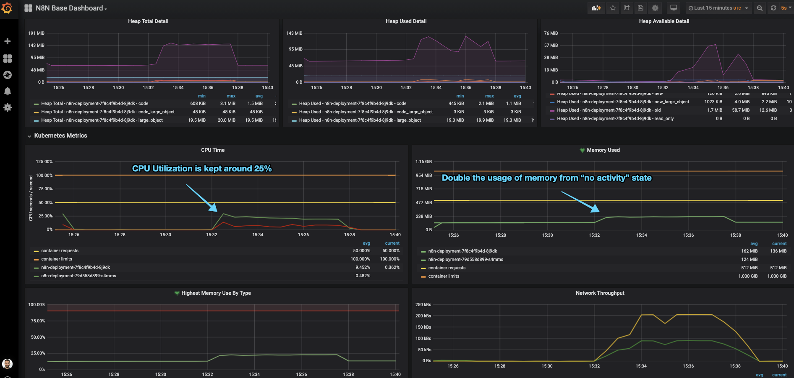

_This post is a continuation on ["Setup n8n on Kubernetes"](/blog/setup-n8n-on-kubernetes), so most of the things we talk here assume that you've followed/read this one as well._

-----

After running n8n during a couple of months in production, me and my team realized that the default configuration do not work very well for us.

So here in this post I go over the changes we did to allow n8n to scale and work without problems.

# NodeJS default max memory

If you look closely on our resource allocation for our n8n service, you will see that we've requested Kubernetes to allocate for us **1Gbi of memory**, although we are not using it all _yet_.


# ~/k8s/n8n-deployment.yaml
---
apiVersion: apps/v1
kind: Deployment
metadata:
  name: n8n-deployment
  namespace: default
  labels: &labels
    app: n8n
    component: deployment
spec:
  replicas: 1
  selector:
    matchLabels: *labels
  template:
    metadata:
      labels: *labels
    spec:
      containers:
      - name: n8n
        image: n8nio/n8n:latest
        imagePullPolicy: IfNotPresent
        ports:
        - name: http
          containerPort: 5678
        resources:
          limits:
            cpu: "1.0"
            memory: "1024Mi"
          requests:
            cpu: "0.5"
            memory: "512Mi"
        (...)



It seems that NodeJS allocates memory differently, depending on the architecture ([_source_](https://bugs.chromium.org/p/v8/issues/detail?id=847)):
* 1Gb of memory if you are on an 64bit architecture,
* and 512mb in a 32bit architecture

To play around with this limit, we're gonna create a memory intensive workflow and see if n8n can handle it.

A simple [Interval](https://docs.n8n.io/nodes/n8n-nodes-base.interval/) + [Function](https://docs.n8n.io/nodes/n8n-nodes-base.function/) workflow will do the trick. Setting up our Interval node to run every 5 seconds, + we can just paste the following code in the Function node, which just generates a big string and reverses it.

```javascript
let big_string = 'x'.repeat(1024*1024*512) // 512mb
big_string.reverse();
items[0].json.big_string = big_string;
return items;
```

If you look at the container logs, you will see something like: **`JavaScript heap out of memory`**.


$ kubectl logs -f -l app=n8n
Version: 0.117.0

 ================================
   Start Active Workflows:
 ================================
   - Memory Intensive Workflow
     => Started

Editor is now accessible via:
http://localhost:5678/

<--- Last few GCs --->

[2010:0x562ff62b6f80]    63991 ms: Scavenge 485.5 (513.8) -> 485.4 (514.8) MB, 71.3 / 0.0 ms  (average mu = 0.845, current mu = 0.771) allocation failure
[2010:0x562ff62b6f80]    64024 ms: Scavenge 486.4 (514.8) -> 486.2 (517.8) MB, 19.9 / 0.0 ms  (average mu = 0.845, current mu = 0.771) allocation failure
[2010:0x562ff62b6f80]    64810 ms: Mark-sweep 489.2 (517.8) -> 488.8 (521.8) MB, 723.0 / 0.0 ms  (average mu = 0.791, current mu = 0.619) allocation failure scavenge might not succeed

<--- JS stacktrace --->

FATAL ERROR: MarkCompactCollector: young object promotion failed Allocation failed - JavaScript heap out of memory


As you can see, we never reach the max memory consumed of 1Gbi because **NodeJS default max allocated memory is 512mb**, on my machine.

To accommodate for heavy memory usage we need to increase the NodeJS default memory and for that we need to add the following configuration to our **n8n-confimap.yaml**:


# ~/k8s/n8n-configmap.yaml
---
apiVersion: v1
kind: ConfigMap
metadata:
  name: n8n-configmap
  namespace: default
  labels:
    app: n8n
    component: configmap
data:
  (...)
  # Increase node max memory
  NODE_OPTIONS: "--max-old-space-size=1024"


With this change the same workflow now uses much more memory (well it has more available 🙃 ). We still might hit the 1Gbi container threshold which will either:
* Kubernetes container runtime detects the container is allocating more that 1Gbi of memory, killing it with OOMKilled error,
* Or NodeJS raising a Fatal Error since it can't allocate more memory to create new objects, like the one above.
> Well, sometimes you might see some spikes over the 1Gbi limit, but afaik that is prometheus being able to scrape the container right that instant, right before the NodeJS process dies from using more that its default, although I can be wrong.

ℹ️  So, if you want to increase your n8n server available memory, not only you need to increase your container Request/Limits, but also add the `--max-old-space-size=` environment variable.

# n8n Execution Mode

If we want to expose our server to the world, lets say with a [dynamic dashboard](https://youtu.be/ifHYNvRFrBU?t=2902), and work with it in an production environment, we need to first do some capacity planning and figure out what n8n can serve.

> There is a section on n8n documentation about Scaling this service using Redis and a worker pool of n8n workers ([_source_](https://docs.n8n.io/reference/scaling-n8n.html)). Although that is a perfectly good solution, thats not the goal of this part of the post. I want to explore how much load this service can handle using the "out of the box" configurations.

The goal here is not to see the result of the workflow but to access:
* How many requests can a simple n8n webhook handle,
* Does it drop any requests and when,
* And if the response times varies to much.

> 🤔 Keep in mind that these tests were made on my MacBook Pro 13-inch, 2019 with a 2.4 GHz Intel Core i5 and 16 GBs of memory ([this one](https://support.apple.com/kb/SP795?viewlocale=en_US&locale=en_US)).

## The workflow

To test this out, we will create a workflow that exposes a Webhook, does some computations and returns 200 OK. We just need to configure:

* A [Webhook](https://docs.n8n.io/nodes/n8n-nodes-base.webhook/) node (GET /load-test) to receive the request
* A [Function](https://docs.n8n.io/nodes/n8n-nodes-base.function/) node to simulate some functionality during 5 seconds


The Function node just runs this snippet:
```javascript
// Node found on https://community.n8n.io/t/wait-node-in-workflow/73/41
const waitTimeSeconds = 5;

return new Promise((resolve) => {
  setTimeout(() => {
    resolve(items);
  }, waitTimeSeconds * 1000);
});
```

## Setup of the test

With that, we can test our endpoint with **[hey](https://github.com/rakyll/hey)**, which is a simple load generator that you can run on your terminal:

```bash
$ hey -z 1m -c 8 -m GET $(minikube service n8n-service --url)/webhook/load-test
```
> This will simulate 8 concurrent clients (`-c 8`) sending GET requests during 1 minute (`-z 1m`).

## Results

After running our initial load tests in minikube, with one pod running with 1GBi of memory and 1CPU, the main n8n process spans an _incredible amount_ of **"WorkerProcesses"** (to handle the concurrent workflows) which ends up throttling our CPU and increasing the memory usage until it kills our pod with either **OOMKill** or unresponsive **/healthz** probe check.

n8n has a configuration flag (`EXECUTIONS_PROCESS`) that changes the behavior of triggering its workflows from the main node process to a child process:


> More information about `EXECUTIONS_PROCESS` can be found here: https://docs.n8n.io/reference/configuration.html#execute-in-same-process. ([_source of image above_](https://github.com/n8n-io/n8n/blob/master/packages/cli/src/WorkflowRunner.ts#L124-L125))

### EXECUTIONS_PROCESS = "own"

The first test was done using n8n forking the execution of workflows into separate processes. (This is the default configuration.)

If we `htop` in our container, we will see that once we start the load test, the amount of processes on the n8n pod skyrocket 📈. After a couple of seconds, the pod is forced to restart since the CPU limit was reached and the server becomes unresponsive (our /healthz probe is not returning 200 OK anymore).


Our `hey` test finishes after the 1 minute, but notice the amount of error responses highlighted below:



Summary:
  Total:	67.9756 secs
  Slowest:	16.6218 secs
  Fastest:	0.0596 secs
  Average:	6.6657 secs
  Requests/sec:	1.2946

  Total data:	3546 bytes
  Size/request:	45 bytes

Response time histogram:
  0.060 [1]		|■■■
  1.716 [15]	|■■■■■■■■■■■■■■■■■■■■■■■■■■■■■■■■■■■■■■
  3.372 [5]		|■■■■■■■■■■■■■
  5.028 [16]	|■■■■■■■■■■■■■■■■■■■■■■■■■■■■■■■■■■■■■■■■
  6.685 [9]		|■■■■■■■■■■■■■■■■■■■■■■■
  8.341 [3]		|■■■■■■■■
  9.997 [6]		|■■■■■■■■■■■■■■■
  11.653 [4]	|■■■■■■■■■■
  13.309 [7]	|■■■■■■■■■■■■■■■■■■
  14.966 [6]	|■■■■■■■■■■■■■■■
  16.622 [6]	|■■■■■■■■■■■■■■■

Latency distribution:
  10% in 0.6381 secs
  25% in 3.0919 secs
  50% in 5.1199 secs
  75% in 11.6893 secs
  90% in 14.4963 secs
  95% in 15.4841 secs
  0% in 0.0000 secs

Details (average, fastest, slowest):
  DNS+dialup:	1.1981 secs, 0.0596 secs, 16.6218 secs
  DNS-lookup:	0.0000 secs, 0.0000 secs, 0.0000 secs
  req write:	0.0001 secs, 0.0000 secs, 0.0007 secs
  resp wait:	5.3817 secs, 0.0485 secs, 15.4839 secs
  resp read:	0.0001 secs, 0.0000 secs, 0.0005 secs

Status code distribution:
  [200]	61 responses
  [404]	17 responses

Error distribution:
  [10]	Get http://192.168.64.7:32495/webhook/load-test: dial tcp 192.168.64.7:32495: connect: connection refused


### EXECUTIONS_PROCESS = "main"

Seeing that the default configuration couldn't hold multiple concurrent requests, we updated ou **n8n-configmap.yaml** with the `EXECUTIONS_PROCESS=main` environment:


# ~/k8s/n8n-configmap.yaml
---
apiVersion: v1
kind: ConfigMap
metadata:
  name: n8n-configmap
  namespace: default
  labels:
    app: n8n
    component: configmap
data:
  (...)
  # Set n8n to work as single thread instead of forking to worker threads
  EXECUTIONS_PROCESS: "main"


With this flag, n8n will take care of asynchronously handle all the requests without forking each request into a new process, simply sending the request to its worker threads (which by default are 10)

This allows the pod to be able to return a successful "/healthz" response and keep much better CPU utilization between the different cores.



This time, our `hey` test doesn't show any error responses:


Summary:
  Total:	60.3879 secs
  Slowest:	0.7173 secs
  Fastest:	0.0304 secs
  Average:	0.0841 secs
  Requests/sec:	95.0356

  Total data:	200865 bytes
  Size/request:	35 bytes

Response time histogram:
  0.030 [1]		|
  0.099 [4836]	|■■■■■■■■■■■■■■■■■■■■■■■■■■■■■■■■■■■■■■■■
  0.168 [683]	|■■■■■■
  0.236 [83]	|■
  0.305 [21]	|
  0.374 [9]		|
  0.443 [20]	|
  0.511 [39]	|
  0.580 [26]	|
  0.649 [15]	|
  0.717 [6]		|

Latency distribution:
  10% in 0.0511 secs
  25% in 0.0581 secs
  50% in 0.0685 secs
  75% in 0.0863 secs
  90% in 0.1135 secs
  95% in 0.1413 secs
  99% in 0.4957 secs

Details (average, fastest, slowest):
  DNS+dialup:	0.0000 secs, 0.0304 secs, 0.7173 secs
  DNS-lookup:	0.0000 secs, 0.0000 secs, 0.0000 secs
  req write:	0.0000 secs, 0.0000 secs, 0.0008 secs
  resp wait:	0.0840 secs, 0.0303 secs, 0.7172 secs
  resp read:	0.0000 secs, 0.0000 secs, 0.0007 secs

Status code distribution:
  [200]	5739 responses



ℹ️ So, in conclusion, if your n8n usage follows more on the heavy I/O operations (vs CPU bound, like returning fibonacci sequences) then you want to setup the execution configuration to not fork its main process, using the `EXECUTIONS_PROCESS=main`.
> On n8n community forum there are some good threads explain the rational for this [1](https://community.n8n.io/t/workflowrunner-use-fork-to-create-subprocess-when-webhook-always-receive-request-will-make-many-subprocess-and-cpu-usage-so-high/348), [2](https://community.n8n.io/t/handling-of-the-n8n-worker-processes/5213)


# Need more scale? Use Redis.

In the scenario where we have to scale n8n to serve much more traffic/webhooks, we can take advantage of its built-in integration with Redis which the main n8n node (producers) would broadcast all workflow events to a Redis instance (broker) which would then be consumed by n8n worker nodes (consumers).
> There is a community thread that introduces this: https://community.n8n.io/t/slow-webhook-response-performance-high-cpu/3314/6

# Summary

Well, this has been one of my biggest blogpost series, _so far_ 😁

Writing all of this, along side with the slides, images and examples, took more time that I was hoping but in the end I end up doing these things for myself, and if there's anyone that can learn or take advantage of these example, thats awesome.

If you find anything that is not correct or if you just have questions about some of my decisions here, feel free ask below or just PM me!


# Resources
* `--max-old-space-size` flag: https://stackoverflow.com/questions/48387040/how-do-i-determine-the-correct-max-old-space-size-for-node-js/48392705#48392705
* NodeJS memory limits: http://www.the-data-wrangler.com/nodejs-memory-limits/
* n8n multiple execution configurations: https://docs.n8n.io/reference/configuration.html#execute-in-same-process
* Handling n8n worker processes https://community.n8n.io/t/handling-of-the-n8n-worker-processes/5213/3
* How to scale your n8n instance: https://www.youtube.com/watch?v=PnoE0xV8BX8


👋
