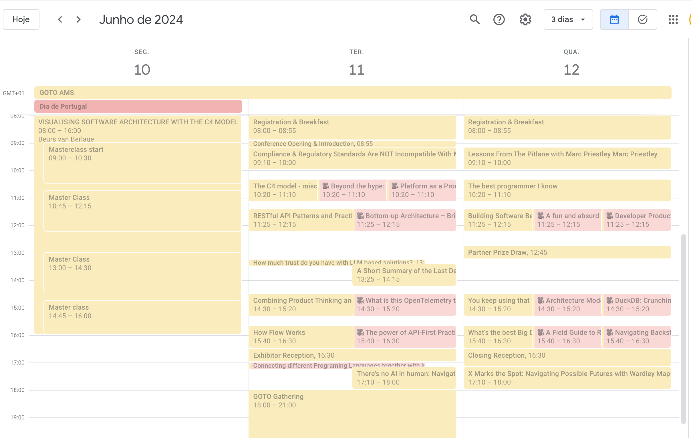

I really enjoy conferences. I think it's one of the best things the tech industry has!

Covid stopped us from going to "in-person" conferences, and we all had to shift to a more "remote" or "online" version of it. You still got to see some great talks, but there's a world of difference between how you experience and learn from them.

This year I've finally got back to an "in-person" conference, and being so excited about attending one again I started making a list of what I should do to make the most out of it.

> I went to GoTo Amsterdam. There was some speakers that I really wanted to meet ([Simon Brown](https://simonbrown.je/), [Sam Newman](https://samnewman.io/), [Simon Wardley](https://learnwardleymapping.com/)). Also, my brother works in Amsterdam, so I just combined business with pleasure :)

Anyway, here's my "go to conferences" list:

# Before the Conference - Prepare and Plan

## Get to know the place

One of the perks of going to a conference is visiting a place you haven't visited before. If you have the extra time, take some of it to look around the venue on Google Maps for things to do like trying some restaurants, a museum or even going for a walk in nearby parks.

Conferences usually last for a couple of days and call for business/casual attire: the more "dev" focused the conference is, the less "dress-to-impress" they are.
Dress comfortably because you will be sitting in +1 hours sessions and walking a bunch. Very important: wear good shoes!

If you have the option to pre-register and get your badge/ticket earlier, do that. You'll get to skip the line on the first day of the conference which is usually pretty crowded. Don't forget to bring your ID and/or Passport.

## Schedule is key:

As soon as you get your ticket, you should be able to access the conference schedule. Find out if they have the schedule in `.ical` format or any sort of file that you can import to your Google Calendar or equivalent. If not, create a schedule with the talks you want to attend.
> You might not be able to attend all talks but take note of them because most conferences these days share the recordings and you can also check back on them when they are available.

Sometimes the conference has its own app that you can use to favorite your talks. Use that if it's easier.

The point is: 👉 **check the schedule before the conference begins** 👈.

# During the conference - Learn and Enjoy

## Workshops and Masterclasses

GoTo conference is known for having workshops with experts in their field. Those usually cost extra and have limited seating. If you are interested in going to one, make sure you book it early because they usually run out pretty quickly.

Make sure you prepare some questions beforehand as well. You'll have plenty of opportunities to ask them, so make sure you take advantage of being in the same room as them because it not every day that you have the chance of asking an expert for things that interest you.

## Talks

Presenters are a big component when choosing which talks I want to attend. Secondly, I consider if there are any interesting topics, regardless of who is the person talking about them. My point is that a good presenter will hold your attention and explain content better than others. If they are an expert in the field/technology, that helps too.

As an introvert, I know it can be hard to put yourself out there, especially if you go to a conference just by yourself, but try to sit in front (or in the first 5 rows). It will make you be more attentive to what the speaker is presenting and consequently make you more engaged.

Also, keep an eye out for talks that look a bit more like "marketing/sponsor" stuff. Unfortunately, you'll realize that midway through the talk (sometimes they sound like an ad for a particular solution or technology). Although they can be valuable, take them with a grain of salt, since they can be skewed for a particular point of view.

## Notes and Pictures

Take notes and lots of pictures.

You can turn notes into blog posts (_hellow there_ :)) or reports that you can share with your team/organization. Pictures help you see what spotted your interest.
> They also give you a sense of a "timeline". For me at least, I can remember better the previous days and what I was thinking when I took those pictures: "That's right, on the first day we had the talk about Backstage being adopted into that organization and managing around 3k services, and on the second day it was the sponsored talk from Spotify, talking about how Backstage was released into the wild".

Notes and pictures are also references for you to check later on (take pictures of any books and links speakers share).

It's worth mentioning that in some conferences the presenters share the slides on their website/github, so one might argue that is not worth taking pictures of the slides. That makes sense, but having pictures on my phone works as a reminder for me to review those slides later.

## Networking

Don't forget that like you, other people went to the same conference to check the same talks as you. An easy way to break the ice with strangers is to just ask "Have you enjoyed this talk?" or "Did you go to X talk? What did you think about it?"

You'll end up realizing that a lot of people also want to network and get to know other peers. Don't do it for the "linked-in connection", do it for the different points of view and experiences.

Ask people what they do, and what projects they are working on. "What company do you work for" or "What's your role there?" are great. Chances are you will learn something new, even if the people you meet are solving the same problems as you.

Also, make sure you attend the conference after-party. Even if you just go for one drink. It's a great way to socialize and meet new people.

# After the conference - Reflect and Share

Conferences are inspiring. You'll most likely learn a couple of new things, meet some people, and have some stories to share afterward.

Now that it has ended it's time for you to look back at your notes and make some sense from them. There might be some gold nuggets in there that apply to your work. Take some time to reflect on why those slides or topics resonated with you.

Write a blog post or something equivalent. You don't need to share it but it will help you make sense of the event. (although if you do, share it here so I can also read about your learnings :))

Make a list of the talks you find relevant and share it with your team/organization. They will appreciate the curated list.

# Resources:

* Networking Strategy for Making Meaningful Connections in Tech: https://dev.to/tanoaksam/my-networking-strategy-for-making-meaningful-connections-in-tech-1702
* What I learned from submitting my first speech to a tech conference: https://dev.to/sjarva/what-i-learned-from-submitting-a-speech-to-a-tech-conference-3aa
* Advice for an introvert jr dev who wants to give talks at local meetups? https://dev.to/rsanchezp/advice-for-an-introvert-jr-dev-who-wants-to-give-a-talk-at-local-meetups-20mp
* Episode 403: Karl Hughes on Speaking at Tech Conferences https://pt.player.fm/series/software-engineering-radio/episode-403-karl-hughes-on-speaking-at-tech-conferences-xLWZpOG6a78pIOs8

👋 Thanks for reading my "conferences 101" list :)
